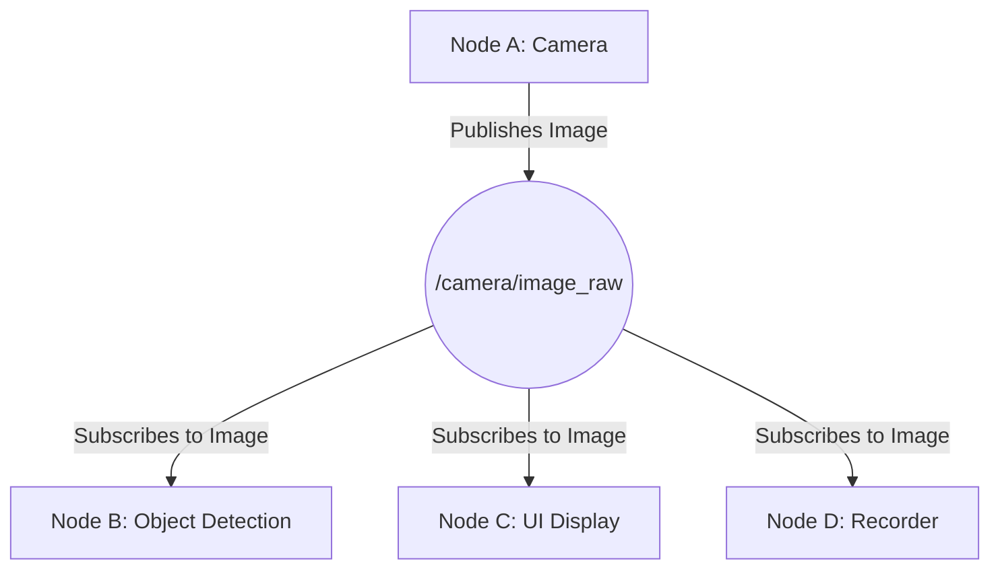
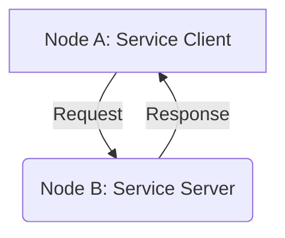

# Chapter 03 – ROS 2 Architecture, Nodes, Topics, Services, and Actions

Welcome to the nervous system of our humanoid robot. Before we can make it walk, talk, or think, we must first build the intricate network of pathways that allow its digital mind to communicate with its physical body. That network is ROS 2, the Robot Operating System. In this chapter, we'll dissect its fundamental architecture, moving from the high-level concepts that differentiate it from its predecessor, ROS 1, down to the practical building blocks you'll use every day: nodes, topics, services, and actions.

## 3.1 Why ROS 2? A New Architecture for Modern Robotics

The original Robot Operating System (ROS 1) revolutionized robotics by providing a standardized framework for hardware abstraction, device drivers, and message-passing. However, as robotics evolved, the limitations of ROS 1's core design became apparent. It was not built for the demands of multi-robot systems, real-time control, or production-grade environments.

ROS 2 was engineered from the ground up to address these challenges [^1]. It is not merely an update; it is a fundamental redesign. The primary and most critical change was replacing the custom ROS 1 communication system with the **Data Distribution Service (DDS)** [^2], an industry standard for real-time and mission-critical systems developed by the Object Management Group (OMG).

**DDS: The Backbone of ROS 2**

DDS is a middleware protocol that provides a "Global Data Space"—a virtual space where any application can publish or subscribe to data in a secure, reliable, and platform-independent way. This shift solves several key problems of ROS 1:

1.  **Decentralized Discovery:** In ROS 1, a central `roscore` (the "master") was required to register all nodes and manage communication. This created a single point of failure. If the master went down, the entire system would collapse. ROS 2, using DDS, has no master. Nodes discover each other automatically on the network, making the system far more robust and scalable.
2.  **Real-Time Performance:** DDS is designed with real-time applications in mind. It provides fine-grained control over Quality of Service (QoS) settings, allowing developers to tune communication for reliability, latency, and durability. This is critical for humanoid robotics, where a missed message could be the difference between a stable step and a fall.
3.  **Production-Ready:** DDS is a mature, battle-tested standard used in aerospace, industrial automation, and defense. By adopting it, ROS 2 inherits its security features, cross-vendor interoperability, and proven reliability.

This architectural shift is the single most important reason ROS 2 has supplanted ROS 1 for serious robotics development.

## 3.2 The Core Concepts: Nodes

In ROS 2, a **node** is the smallest, most fundamental unit of computation [^3]. Think of a node as a single, self-contained program that performs a specific task. For our humanoid, we might have nodes for:
-   Reading data from an IMU (Inertial Measurement Unit)
-   Controlling the motors in the left leg
-   Processing images from a head-mounted camera
-   Planning a path to a goal location

Each node is an independent executable that can be run, stopped, and debugged separately. This modularity is a cornerstone of ROS, making systems easier to manage and debug.

Let's write our very first ROS 2 node in Python using `rclpy` (the ROS Client Library for Python). This node will simply print a message to the console.

**Code Example 1: `simple_node.py`**
```python
import rclpy
from rclpy.node import Node

class SimpleNode(Node):
    def __init__(self):
        super().__init__('simple_node')
        self.get_logger().info('Hello, I am a simple ROS 2 node!')

def main(args=None):
    rclpy.init(args=args)
    node = SimpleNode()
    rclpy.spin(node)
    node.destroy_node()
    rclpy.shutdown()

if __name__ == '__main__':
    main()
```

To run this, you would save it in a Python file and execute it after sourcing your ROS 2 environment. We'll cover creating packages and building code in the next chapter. For now, let's break down this example:

-   `rclpy.init()`: Initializes the ROS 2 communication system.
-   `SimpleNode(Node)`: We define our node by creating a class that inherits from `rclpy.node.Node`.
-   `super().__init__('simple_node')`: The constructor for the `Node` class is called, and we give our node a unique name, `'simple_node'`.
-   `rclpy.spin(node)`: This is the main event loop for the node. It keeps the program running so it can listen for incoming messages and events.
-   `node.destroy_node()` and `rclpy.shutdown()`: Cleanly shuts down the node and the ROS 2 client library.

## 3.3 Communication Patterns

Nodes are useful on their own, but their true power comes from communication. ROS 2 provides three primary communication patterns for this: Topics, Services, and Actions.

### Topics: The One-to-Many Broadcast

**Topics** are the most common communication method [^4]. They operate on an anonymous publish/subscribe model. A node can "publish" a message to a topic, and any number of other nodes can "subscribe" to that topic to receive the message. The publisher doesn't know or care who is listening.

**Use Case:** Broadcasting sensor data. A camera node would publish images to a `/camera/image_raw` topic. Multiple other nodes—for object detection, for saving to disk, for streaming to a UI—could all subscribe to this one topic simultaneously.

**Mermaid Diagram: Topic Communication**


**Code Example 2: `simple_publisher.py`**
```python
import rclpy
from rclpy.node import Node
from std_msgs.msg import String

class SimplePublisher(Node):
    def __init__(self):
        super().__init__('simple_publisher')
        self.publisher_ = self.create_publisher(String, 'chatter', 10)
        self.timer = self.create_timer(0.5, self.timer_callback)
        self.i = 0

    def timer_callback(self):
        msg = String()
        msg.data = f'Hello World: {self.i}'
        self.publisher_.publish(msg)
        self.get_logger().info(f'Publishing: "{msg.data}"')
        self.i += 1

def main(args=None):
    rclpy.init(args=args)
    node = SimplePublisher()
    rclpy.spin(node)
    node.destroy_node()
    rclpy.shutdown()

if __name__ == '__main__':
    main()
```
This node creates a publisher on the topic `chatter` and, twice a second, publishes a string message. Notice the `std_msgs.msg.String` type. All data on topics is sent via strongly-typed messages.

### Services: The Two-Way Request/Response

**Services** are for synchronous, two-way communication [^5]. A "service client" sends a request to a "service server," which processes the request and sends back a response. The client waits (blocks) until the response is received.

**Use Case:** Triggering an action that should have a direct confirmation. For example, a node might call a service on a `/set_led_state` service to turn an LED on. The service would return a `success: true` response if the operation was completed.

**Mermaid Diagram: Service Communication**


### Actions: The Asynchronous, Goal-Oriented Task

**Actions** are for long-running, asynchronous tasks that provide feedback [^6]. They are the most complex of the three patterns but are essential for robotics. An "action client" sends a "goal" to an "action server." The server begins executing the goal and can provide continuous feedback to the client. The client can also cancel the goal at any time.

**Use Case:** Moving a robot's arm to a specific position. This is not instantaneous.
1.  **Client sends Goal:** `move_arm_to(x, y, z)`
2.  **Server accepts Goal:** Begins the arm movement process.
3.  **Server sends Feedback:** Periodically sends the current arm position `(current_x, current_y, current_z)`.
4.  **Server sends Result:** When the arm reaches the target, it sends a final result, e.g., `{success: true, time_taken: 3.4s}`.

**Mermaid Diagram: Action Communication**
```mermaid
graph TD
    subgraph "Action Client (Node A)"
        A1[Send Goal]
        A2[Receive Feedback]
        A3[Receive Result]
        A4[Cancel Goal (Optional)]
    end
    subgraph "Action Server (Node B)"
        B1[Accept/Reject Goal]
        B2[Execute Goal & Send Feedback]
        B3[Send Result]
        B4[Handle Cancellation]
    end
    A1 --> B1;
    B2 --> A2;
    B3 --> A3;
    A4 --> B4;
```
We will build examples for services and actions in the next chapter as we start building full-fledged ROS 2 packages.

By understanding these core architectural components—DDS, nodes, topics, services, and actions—you now have the foundational knowledge to start building the nervous system for our humanoid. In Chapter 4, we will take these concepts and apply them to create our first proper ROS 2 package.

---

## References

[^1]: ROS 2 Documentation. "About ROS 2 — ROS 2 Documentation: Humble documentation." *ROS.org*, [https://docs.ros.org/en/humble/Concepts/About-ROS-2-introduction.html](https://docs.ros.org/en/humble/Concepts/About-ROS-2-introduction.html).
[^2]: ROS 2 Documentation. "About DDS and ROS Middleware Abstraction — ROS 2 Documentation: Humble documentation." *ROS.org*, [https://docs.ros.org/en/humble/Concepts/About-DDS-and-ROS-Middleware-Abstraction.html](https://docs.ros.org/en/humble/Concepts/About-DDS-and-ROS-Middleware-Abstraction.html).
[^3]: ROS 2 Documentation. "About Nodes — ROS 2 Documentation: Humble documentation." *ROS.org*, [https://docs.ros.org/en/humble/Concepts/About-Nodes.html](https://docs.ros.org/en/humble/Concepts/About-Nodes.html).
[^4]: ROS 2 Documentation. "Understanding ROS 2 Topics — ROS 2 Documentation: Humble documentation." *ROS.org*, [https://docs.ros.org/en/humble/Tutorials/Beginner-CLI-Tools/Understanding-ROS2-Topics/Understanding-ROS2-Topics.html](https://docs.ros.org/en/humble/Tutorials/Beginner-CLI-Tools/Understanding-ROS2-Topics/Understanding-ROS2-Topics.html).
[^5]: ROS 2 Documentation. "Understanding ROS 2 Services — ROS 2 Documentation: Humble documentation." *ROS.org*, [https://docs.ros.org/en/humble/Tutorials/Beginner-CLI-Tools/Understanding-ROS2-Services/Understanding-ROS2-Services.html](https://docs.ros.org/en/humble/Tutorials/Beginner-CLI-Tools/Understanding-ROS2-Services/Understanding-ROS2-Services.html).
[^6]: ROS 2 Documentation. "Understanding ROS 2 Actions — ROS 2 Documentation: Humble documentation." *ROS.org*, [https://docs.ros.org/en/humble/Tutorials/Beginner-CLI-Tools/Understanding-ROS2-Actions/Understanding-ROS2-Actions.html](https://docs.ros.org/en/humble/Tutorials/Beginner-CLI-Tools/Understanding-ROS2-Actions/Understanding-ROS2-Actions.html).
