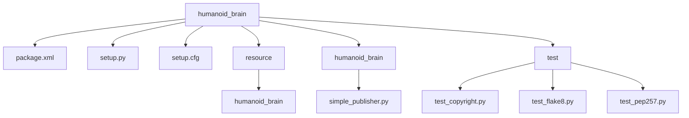
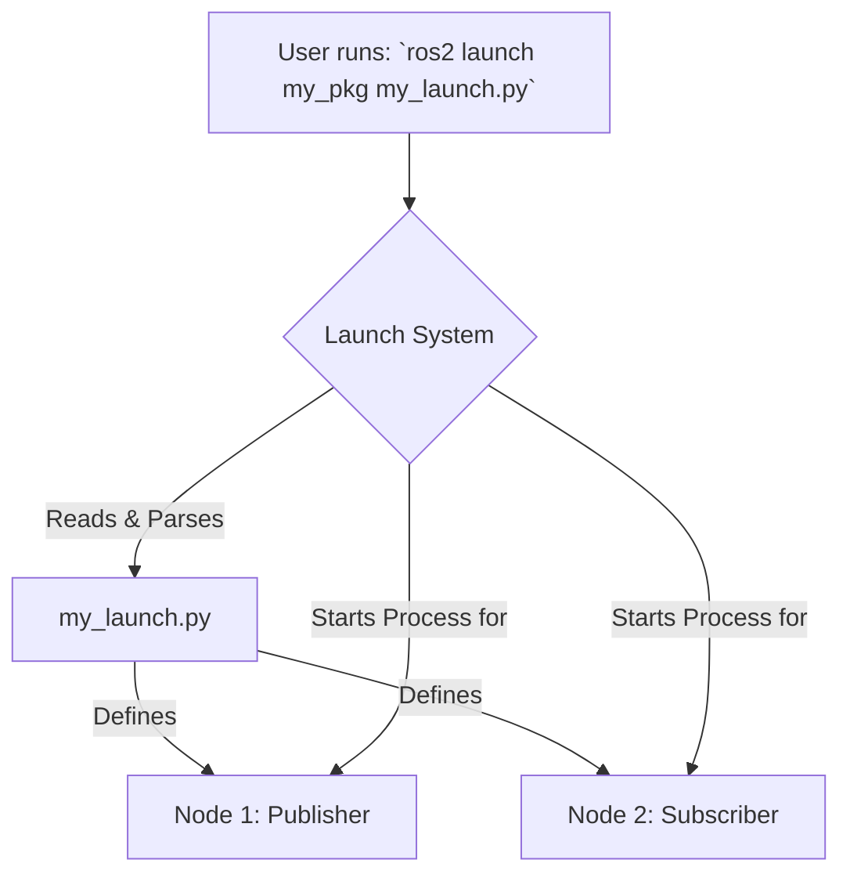

# Chapter 04 – Building Humanoid ROS 2 Packages with Python + rclpy

In the previous chapter, we learned about the fundamental components of ROS 2. Now, it's time to get our hands dirty and organize our code into robust, reusable, and shareable units called **packages**. A ROS 2 package is simply a directory containing your code, launch files, configuration, and a manifest file (`package.xml`) that describes it.

This chapter is a practical, step-by-step guide. We will create a ROS 2 workspace, build a custom Python package for our humanoid, write publisher and subscriber nodes, and learn how to launch them efficiently. All examples are built using `rclpy` and tested on ROS 2 Humble, ensuring they run on both a standard Ubuntu 22.04 desktop and an NVIDIA Jetson Orin.

## 4.1 The ROS 2 Workspace and `colcon`

A **workspace** is a directory where you manage multiple ROS 2 packages. The standard tool for building packages is `colcon` [^7], which stands for "collective construction." It's a command-line tool that finds, builds, and installs all the packages in your workspace in the correct order based on their dependencies.

Let's create our first workspace.

**Code Example 3: Creating a Workspace**
```bash
# Create a new directory for our humanoid project
mkdir -p humanoid_ws/src

# Navigate into the source space
cd humanoid_ws/src
```

It's a convention to have a `src` directory inside your workspace. This is where you will clone or create your ROS 2 packages. The structure is simple:

```
humanoid_ws/
└── src/
    ├── my_first_package/
    │   ├── ...
    └── another_package/
        ├── ...
```

## 4.2 Creating a Python Package

Now, inside the `src` directory, we'll use the `ros2 pkg create` command to generate a skeleton for our Python package [^8], [^9]. We'll name it `humanoid_brain` as it will eventually contain the high-level logic for our robot.

**Code Example 4: Creating a Package**
```bash
# Ensure you are in the humanoid_ws/src directory
ros2 pkg create --build-type ament_python --node-name simple_publisher humanoid_brain
```

Let's break down this command:
-   `--build-type ament_python`: This tells `colcon` that we are creating a Python package. The build system for ROS 2 is called `ament` [^16].
-   `--node-name simple_publisher`: This automatically creates a basic executable script for a node named `simple_publisher`.
-   `humanoid_brain`: This is the name of our package.

This command generates the following directory structure:

**Diagram: `humanoid_brain` Package Structure**


The most important files are:
-   **`package.xml`**: The package manifest. It contains metadata like the package name, version, author, dependencies, and a description [^8].
-   **`setup.py`**: The Python setup script used by `colcon` to install the package and its executables [^9].
-   **`humanoid_brain/simple_publisher.py`**: The actual node script we asked the command to create.

## 4.3 Adding Our Publisher and Subscriber Nodes

Let's modify the generated files to include the publisher from Chapter 3 and add a corresponding subscriber. This process of creating publisher and subscriber nodes using `rclpy` is fundamental to ROS 2 communication [^9].

First, edit the `package.xml` to add a dependency on `rclpy` and `std_msgs`, which we'll need for our nodes.

**Code Example 5: `package.xml`**
```xml
<?xml version="1.0"?>
<package format="3">
  <name>humanoid_brain</name>
  <version>0.0.0</version>
  <description>High-level logic for the humanoid robot.</description>
  <maintainer email="user@example.com">Your Name</maintainer>
  <license>Apache License 2.0</license>

  <depend>rclpy</depend>
  <depend>std_msgs</depend>

  <test_depend>ament_copyright</test_depend>
  <test_depend>ament_flake8</test_depend>
  <test_depend>ament_pep257</test_depend>
  <test_depend>python3-pytest</test_depend>

  <export>
    <build_type>ament_python</build_type>
  </export>
</package>
```

Next, let's create a subscriber node. Create a new file `humanoid_brain/simple_subscriber.py`.

**Code Example 6: `simple_subscriber.py`**
```python
import rclpy
from rclpy.node import Node
from std_msgs.msg import String

class SimpleSubscriber(Node):
    def __init__(self):
        super().__init__('simple_subscriber')
        self.subscription = self.create_subscription(
            String,
            'chatter',
            self.listener_callback,
            10)
        self.subscription  # prevent unused variable warning

    def listener_callback(self, msg):
        self.get_logger().info(f'I heard: "{msg.data}"')

def main(args=None):
    rclpy.init(args=args)
    node = SimpleSubscriber()
    rclpy.spin(node)
    node.destroy_node()
    rclpy.shutdown()

if __name__ == '__main__':
    main()
```
This node subscribes to the `chatter` topic and prints any message it receives.

Now, we need to tell `colcon` about our new subscriber script. We do this by editing `setup.py`. We add the `simple_subscriber` to the `entry_points` dictionary. This makes the node executable from the command line after building.

**Code Example 7: `setup.py`**
```python
from setuptools import setup

package_name = 'humanoid_brain'

setup(
    name=package_name,
    version='0.0.0',
    packages=[package_name],
    data_files=[
        ('share/ament_index/resource_index/packages',
            ['resource/' + package_name]),
        ('share/' + package_name, ['package.xml']),
    ],
    install_requires=['setuptools'],
    zip_safe=True,
    maintainer='Your Name',
    maintainer_email='user@example.com',
    description='High-level logic for the humanoid robot.',
    license='Apache License 2.0',
    tests_require=['pytest'],
    entry_points={
        'console_scripts': [
            'simple_publisher = humanoid_brain.simple_publisher:main',
            'simple_subscriber = humanoid_brain.simple_subscriber:main',
        ],
    },
)
```
Finally, let's update `humanoid_brain/simple_publisher.py` with the code from the previous chapter to make it a bit more interesting.

**Code Example 8: `simple_publisher.py` (Updated)**
```python
import rclpy
from rclpy.node import Node
from std_msgs.msg import String

class SimplePublisher(Node):
    def __init__(self):
        super().__init__('simple_publisher')
        self.publisher_ = self.create_publisher(String, 'chatter', 10)
        self.timer = self.create_timer(0.5, self.timer_callback)
        self.i = 0
        self.get_logger().info('Publisher node started and is publishing...')

    def timer_callback(self):
        msg = String()
        msg.data = f'Humanoid Brain pulse: {self.i}'
        self.publisher_.publish(msg)
        self.get_logger().info(f'Publishing: "{msg.data}"')
        self.i += 1

def main(args=None):
    rclpy.init(args=args)
    node = SimplePublisher()
    rclpy.spin(node)
    node.destroy_node()
    rclpy.shutdown()

if __name__ == '__main__':
    main()
```

## 4.4 Building and Running the Package

Our package is now ready to be built. Navigate to the root of your workspace (`humanoid_ws`) and run `colcon build`.

**Code Example 9: Building the Workspace**
```bash
# Navigate to the workspace root
cd ~/humanoid_ws

# Build all packages in the workspace
colcon build
```
You'll see a lot of output as `colcon` builds and installs your package. After it finishes, three new directories will appear in your workspace: `build`, `install`, and `log`.

**Diagram: The `colcon` Build Process**
```mermaid
graph TD
    A[Workspace (e.g., humanoid_ws)] --> B(src);
    B -- Contains --> C[Package 1];
    B -- Contains --> D[Package 2];
    
    subgraph "colcon build"
        direction LR
        E(Build)
        F(Install)
        G(Log)
    end

    A --> E;
    A --> F;
    A --> G;
    
    C --> E;
    D --> E;
```

The `install` directory contains the setup files you need to source to make your package available in the environment.

Now, open two separate terminals. In each one, you must first source the main ROS 2 environment and then source your new workspace's setup file.

**Terminal 1: Source and Run Publisher**
```bash
# Source ROS 2 Humble (adjust for your specific ROS 2 version)
source /opt/ros/humble/setup.bash

# Source your workspace
source ~/humanoid_ws/install/setup.bash

# Run the publisher node
ros2 run humanoid_brain simple_publisher
```

**Terminal 2: Source and Run Subscriber**
```bash
# Source ROS 2 Humble
source /opt/ros/humble/setup.bash

# Source your workspace
source ~/humanoid_ws/install/setup.bash

# Run the subscriber node
ros2 run humanoid_brain simple_subscriber
```

If everything is correct, you will see the publisher's output in Terminal 1 and the subscriber's "I heard..." messages in Terminal 2. You have successfully built and run your first ROS 2 package!

## 4.5 Implementing Services and Actions: Request/Response and Long-Running Tasks

Topics are powerful for continuous data streams, but robotics often requires different communication patterns.
-   **Services** are used for synchronous request/response interactions, like asking a question and waiting for a direct answer.
-   **Actions** are used for asynchronous, long-running tasks that provide feedback and can be canceled, like telling a robot to navigate to a goal.

To use custom services or actions, we must first define their structure in interface files. This requires creating a `CMakeLists.txt` file even in a Python project, as it's used to generate the Python code from the interface definitions.

### 4.5.1 Creating Custom Interfaces

First, create a `CMakeLists.txt` in the root of your `humanoid_brain` package.

**Code Example (New): `CMakeLists.txt`**
```cmake
cmake_minimum_required(VERSION 3.8)
project(humanoid_brain)

find_package(ament_cmake REQUIRED)
find_package(rosidl_default_generators REQUIRED)

rosidl_generate_interfaces(${PROJECT_NAME}
  "srv/AddTwoInts.srv"
  "action/Fibonacci.action"
)

ament_package()
```

Next, update `package.xml` to include the dependencies needed to build these interfaces.

**Code Example (Update): `package.xml` additions**
```xml
  <buildtool_depend>ament_cmake</buildtool_depend>

  <build_depend>rosidl_default_generators</build_depend>
  <exec_depend>rosidl_default_runtime</exec_depend>
  <member_of_group>rosidl_interface_packages</member_of_group>
```
Now, create the directories for our service and action definitions.
```bash
# Inside ~/humanoid_ws/src/humanoid_brain
mkdir srv
mkdir action
```

### 4.5.2 Implementing a Service

Let's create a simple service that adds two integers. Create the file `srv/AddTwoInts.srv`.

**Code Example (New): `srv/AddTwoInts.srv`**
```
int64 a
int64 b
---
int64 sum
```
The `---` separates the request from the response.

Now, create the service server node `humanoid_brain/add_two_ints_server.py`.

**Code Example (New): `add_two_ints_server.py`**
```python
import rclpy
from rclpy.node import Node
from humanoid_brain.srv import AddTwoInts

class AddTwoIntsServer(Node):
    def __init__(self):
        super().__init__('add_two_ints_server')
        self.srv = self.create_service(AddTwoInts, 'add_two_ints', self.add_two_ints_callback)
        self.get_logger().info('Service "add_two_ints" is ready.')

    def add_two_ints_callback(self, request, response):
        response.sum = request.a + request.b
        self.get_logger().info(f'Incoming request: a={request.a}, b={request.b}. Returning sum={response.sum}')
        return response

def main(args=None):
    rclpy.init(args=args)
    node = AddTwoIntsServer()
    rclpy.spin(node)
    rclpy.shutdown()

if __name__ == '__main__':
    main()
```
And the corresponding client, `humanoid_brain/add_two_ints_client.py`.

**Code Example (New): `add_two_ints_client.py`**
```python
import sys
import rclpy
from rclpy.node import Node
from humanoid_brain.srv import AddTwoInts

class AddTwoIntsClient(Node):
    def __init__(self):
        super().__init__('add_two_ints_client')
        self.cli = self.create_client(AddTwoInts, 'add_two_ints')
        while not self.cli.wait_for_service(timeout_sec=1.0):
            self.get_logger().info('Service not available, waiting again...')
        self.req = AddTwoInts.Request()

    def send_request(self, a, b):
        self.req.a = a
        self.req.b = b
        self.future = self.cli.call_async(self.req)
        rclpy.spin_until_future_complete(self, self.future)
        return self.future.result()

def main(args=None):
    rclpy.init(args=args)
    client_node = AddTwoIntsClient()
    if len(sys.argv) != 3:
        client_node.get_logger().info('Usage: ros2 run humanoid_brain add_two_ints_client X Y')
        return
    
    response = client_node.send_request(int(sys.argv[1]), int(sys.argv[2]))
    client_node.get_logger().info(f'Result of add_two_ints: {response.sum}')
    client_node.destroy_node()
    rclpy.shutdown()

if __name__ == '__main__':
    main()
```

### 4.5.3 Implementing an Action

Actions are for longer tasks. Let's create an action to compute a Fibonacci sequence. Create the file `action/Fibonacci.action`.

**Code Example (New): `action/Fibonacci.action`**
```
int32 order
---
int32[] sequence
---
int32[] partial_sequence
```
The three sections are Goal, Result, and Feedback, each separated by `---`.

Now create the action server `humanoid_brain/fibonacci_action_server.py`.

**Code Example (New): `fibonacci_action_server.py`**
```python
import time
import rclpy
from rclpy.action import ActionServer
from rclpy.node import Node
from humanoid_brain.action import Fibonacci

class FibonacciActionServer(Node):
    def __init__(self):
        super().__init__('fibonacci_action_server')
        self._action_server = ActionServer(
            self,
            Fibonacci,
            'fibonacci',
            self.execute_callback)
        self.get_logger().info('Fibonacci Action Server is ready.')

    def execute_callback(self, goal_handle):
        self.get_logger().info('Executing goal...')
        
        feedback_msg = Fibonacci.Feedback()
        feedback_msg.partial_sequence = [0, 1]
        
        for i in range(1, goal_handle.request.order):
            feedback_msg.partial_sequence.append(
                feedback_msg.partial_sequence[i] + feedback_msg.partial_sequence[i-1])
            self.get_logger().info(f'Feedback: {feedback_msg.partial_sequence}')
            goal_handle.publish_feedback(feedback_msg)
            time.sleep(1)
            
        goal_handle.succeed()
        
        result = Fibonacci.Result()
        result.sequence = feedback_msg.partial_sequence
        return result

def main(args=None):
    rclpy.init(args=args)
    node = FibonacciActionServer()
    rclpy.spin(node)
    rclpy.shutdown()

if __name__ == '__main__':
    main()
```

Finally, before we can run these, we must add them to `setup.py`.

**Code Example (Update): `setup.py` entry_points**
```python
    entry_points={
        'console_scripts': [
            'simple_publisher = humanoid_brain.simple_publisher:main',
            'simple_subscriber = humanoid_brain.simple_subscriber:main',
            'add_two_ints_server = humanoid_brain.add_two_ints_server:main',
            'add_two_ints_client = humanoid_brain.add_two_ints_client:main',
            'fibonacci_server = humanoid_brain.fibonacci_action_server:main',
        ],
    },
```
Rebuild your package with `colcon build`. You can now run the service in one terminal and the client in another.

**Terminal 1:** `ros2 run humanoid_brain add_two_ints_server`
**Terminal 2:** `ros2 run humanoid_brain add_two_ints_client 5 10`

The client will print the sum `15`. You can do the same for the action server. The command `ros2 action send_goal` provides a convenient command-line client.

**Terminal 1:** `ros2 run humanoid_brain fibonacci_server`
**Terminal 2:** `ros2 action send_goal fibonacci humanoid_brain/action/Fibonacci '{order: 5}' --feedback`
You will see the server printing feedback every second as it computes the sequence.


## 4.6 Efficiently Launching Nodes with Launch Files

Opening a new terminal for every node is tedious. **Launch files** are the solution. They are Python scripts that allow you to start and configure multiple nodes at once [^10].

Let's create a launch file for our publisher/subscriber system. First, create a `launch` directory inside your package.

**Code Example 10: Creating Launch Directory**
```bash
# Navigate to your package
cd ~/humanoid_ws/src/humanoid_brain

# Create the launch directory
mkdir launch
```

Now, create a file named `brain_launch.py` inside the `launch` directory.

**Code Example 11: `brain_launch.py`**
```python
from launch import LaunchDescription
from launch_ros.actions import Node

def generate_launch_description():
    return LaunchDescription([
        Node(
            package='humanoid_brain',
            executable='simple_publisher',
            name='chatter_publisher'
        ),
        Node(
            package='humanoid_brain',
            executable='simple_subscriber',
            name='chatter_subscriber'
        ),
    ])
```

Finally, we need to tell `colcon` to install this launch file. We modify `setup.py` one more time.

**Code Example 12: `setup.py` (with Launch File)**
```python
import os
from glob import glob
from setuptools import setup

package_name = 'humanoid_brain'

setup(
    # ... (all the previous setup options)
    data_files=[
        ('share/ament_index/resource_index/packages',
            ['resource/' + package_name]),
        ('share/' + package_name, ['package.xml']),
        # Include all launch files
        (os.path.join('share', package_name, 'launch'), glob('launch/*.py')),
    ],
    # ... (rest of the setup options)
)
```

Rebuild your workspace with `colcon build`. Now you can run everything with a single command in one terminal.

**Code Example 13: Using `ros2 launch`**
```bash
# Source your environment
source ~/humanoid_ws/install/setup.bash

# Launch the system
ros2 launch humanoid_brain brain_launch.py
```
You will now see the output from both the publisher and subscriber interleaved in the same terminal window.

**Diagram: `ros2 launch` Execution Flow**



## 4.7 Verifying Your Package with Tests

Building and running nodes is a good first step, but how can we automate verification to ensure our code is high-quality and free of regressions? The ROS 2 testing framework is built on `pytest` [^17] for Python packages and is executed via the `colcon test` command.

When we created our package, a `test` directory was automatically generated with three files: `test_copyright.py`, `test_flake8.py`, and `test_pep257.py`. These are default linters and style checkers:
-   `test_copyright.py`: Checks for a copyright notice in your files.
-   `test_flake8.py`: Checks your code against the PEP 8 style guide.
-   `test_pep257.py`: Checks for compliance with PEP 257 docstring conventions.

You can run these tests by navigating to your workspace root and executing:
```bash
colcon test
```
After the tests complete, you can see a detailed summary:
```bash
colcon test-result --verbose
```

### Writing an Integration Test
While linting is important, let's write a simple integration test that confirms our `simple_publisher` is actually publishing messages. We will use the `launch_testing` framework to launch our node and check its output within a test.

First, add the necessary dependency to your `package.xml`:
```xml
<test_depend>launch_testing_ros</test_depend>
```
Now, create a new test file: `test/test_publisher_launch.py`.

**Code Example (New): `test/test_publisher_launch.py`**
```python
import os
import unittest
import pytest
from launch import LaunchDescription
from launch_ros.actions import Node
from launch.actions import ExecuteProcess
from launch_testing.actions import ReadyToTest
import rclpy
from std_msgs.msg import String

@pytest.mark.launch_test
def generate_test_description():
    # Launch the publisher node
    publisher_node = Node(
        package='humanoid_brain',
        executable='simple_publisher',
        name='test_publisher'
    )
    
    return LaunchDescription([
        publisher_node,
        # Start the test once the publisher is ready
        ReadyToTest(),
    ])

class TestPublisherSubscriber(unittest.TestCase):

    def setUp(self):
        rclpy.init()
        self.node = rclpy.create_node('test_subscriber')
        self.received_msgs = []
        self.subscription = self.node.create_subscription(
            String,
            'chatter',
            self.chatter_callback,
            10
        )

    def tearDown(self):
        self.node.destroy_node()
        rclpy.shutdown()

    def chatter_callback(self, msg):
        self.received_msgs.append(msg)

    def test_messages_received(self):
        # Spin the node for a short period to allow messages to be received
        end_time = self.node.get_clock().now().seconds_nanoseconds()[0] + 2.0
        while rclpy.ok() and self.node.get_clock().now().seconds_nanoseconds()[0] < end_time:
            rclpy.spin_once(self.node, timeout_sec=0.1)
        
        # Assert that we received at least one message
        self.assertGreater(len(self.received_msgs), 0, "Did not receive any messages on /chatter topic")

```
This test launches the `simple_publisher` node and then creates a temporary subscriber to verify that messages are being published on the `/chatter` topic.

After adding the file, rebuild your package and run the tests again with `colcon test`. You will see your new test being executed and passing, confirming your publisher node is working as expected.

In this chapter, you've made a huge leap. You've gone from simple scripts to creating, building, launching, and now testing a complete, multi-node ROS 2 system. This package structure is the foundation upon which we will build the entire software stack for our humanoid robot. In the next chapter, we will model the physical structure of our robot using URDF.

---

## References

[^5]: ROS 2 Documentation. "Understanding ROS 2 Services — ROS 2 Documentation: Humble documentation." *ROS.org*, [https://docs.ros.org/en/humble/Tutorials/Beginner-CLI-Tools/Understanding-ROS2-Services/Understanding-ROS2-Services.html](https://docs.ros.org/en/humble/Tutorials/Beginner-CLI-Tools/Understanding-ROS2-Services/Understanding-ROS2-Services.html).
[^6]: ROS 2 Documentation. "Understanding ROS 2 Actions — ROS 2 Documentation: Humble documentation." *ROS.org*, [https://docs.ros.org/en/humble/Tutorials/Beginner-CLI-Tools/Understanding-ROS2-Actions/Understanding-ROS2-Actions.html](https://docs.ros.org/en/humble/Tutorials/Beginner-CLI-Tools/Understanding-ROS2-Actions/Understanding-ROS2-Actions.html).
[^7]: ROS 2 Documentation. "colcon — ROS 2 Documentation: Humble documentation." *ROS.org*, [https://docs.ros.org/en/humble/Tutorials/Colcon-Tutorial.html](https://docs.ros.org/en/humble/Tutorials/Colcon-Tutorial.html).
[^8]: ROS 2 Documentation. "Creating a New ROS 2 Package — ROS 2 Documentation: Humble documentation." *ROS.org*, [https://docs.ros.org/en/humble/Tutorials/Creating-a-New-ROS2-Package.html](https://docs.ros.org/en/humble/Tutorials/Creating-a-New-ROS2-Package.html).
[^9]: ROS 2 Documentation. "Creating a ROS 2 package (Python) — ROS 2 Documentation: Humble documentation." *ROS.org*, [https://docs.ros.org/en/humble/Tutorials/Beginner-Client-Libraries/Creating-a-ROS2-Package-Python.html](https://docs.ros.org/en/humble/Tutorials/Beginner-Client-Libraries/Creating-a-ROS2-Package-Python.html).
[^10]: ROS 2 Documentation. "Creating a launch file — ROS 2 Documentation: Humble documentation." *ROS.org*, [https://docs.ros.org/en/humble/Tutorials/Launch-Files/Creating-a-Launch-File.html](https://docs.ros.org/en/humble/Tutorials/Launch-Files/Creating-a-Launch-File.html).
[^16]: ROS 2 Documentation. "About ament — ROS 2 Documentation: Humble documentation." *ROS.org*, [https://docs.ros.org/en/humble/Concepts/About-ROS-2-Ament.html](https://docs.ros.org/en/humble/Concepts/About-ROS-2-Ament.html).
[^17]: Pytest Documentation. "pytest: helps you write better programs — pytest documentation." [https://docs.pytest.org/en/stable/](https://docs.pytest.org/en/stable/).
