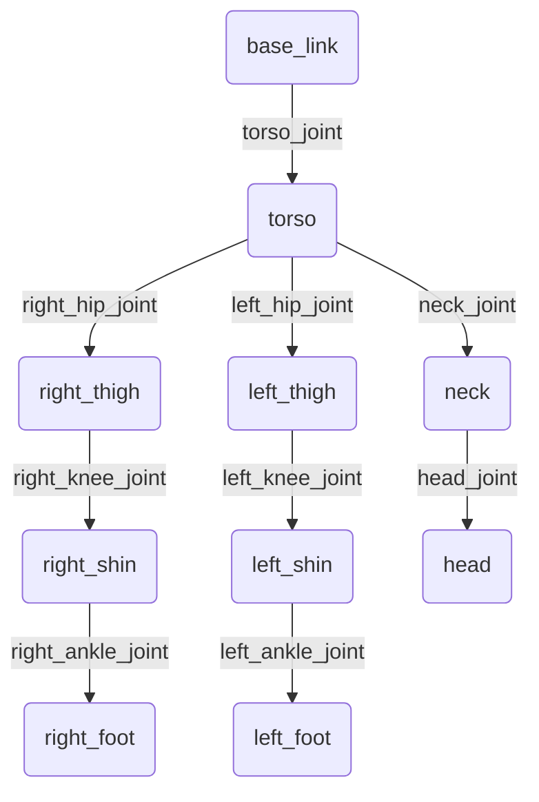
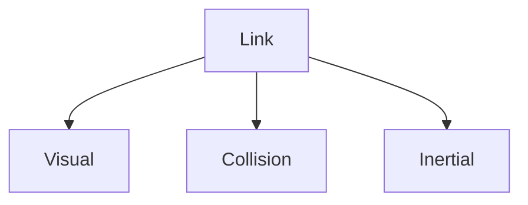
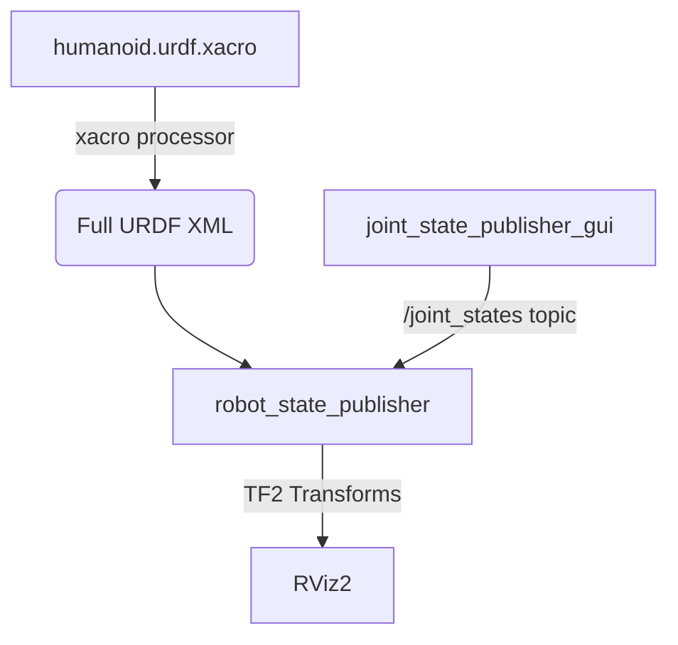

# Chapter 05 – URDF & Xacro Mastery: Describing Complex Humanoids

So far, we have built the nervous system of our robot with ROS 2 nodes and packages. Now, we must give it a body. In the ROS ecosystem, a robot's physical structure—its limbs, joints, and sensors—is described using the **Unified Robot Description Format (URDF)** [^11].

A URDF file is an XML document that specifies the geometry and kinematics of a robot. It is the blueprint used by ROS tools like RViz2 for 3D visualization and Gazebo for physics-based simulation.

Writing a URDF for a simple two-wheeled robot is straightforward. Writing one for a 22-Degree-of-Freedom (DoF) humanoid is a nightmare of repetition and complexity. This is where **Xacro** comes in. Xacro (XML Macros) is a macro language that enhances URDF, allowing us to use variables, create reusable components (macros), and include files [^12]. It is the industry standard for creating clean, maintainable descriptions of complex robots.

In this chapter, we will master both URDF and Xacro, building up from a single link to a complete humanoid model that you can visualize in 3D.

## 5.1 The Building Blocks of URDF: Links and Joints

A robot model in URDF is a tree of **links** connected by **joints**.

-   **`<link>`**: A link represents a rigid body part of the robot, such as a torso, an upper arm, or a foot. It has physical properties like mass and shape.
-   **`<joint>`**: A joint connects two links together and defines their relative motion. It specifies the axis of rotation or translation and may have limits.

The entire structure forms a kinematic tree, with one special link designated as the "root link."

**Diagram: Humanoid Link-Joint Tree Example**


Let's look at a minimal example of a single link connected to a "world" origin.

**Code Example 14: `simple_link.urdf`**
```xml
<robot name="simple_bot">
  <link name="world" />

  <joint name="world_to_base" type="fixed">
    <parent link="world"/>
    <child link="base_link"/>
  </joint>

  <link name="base_link">
    <visual>
      <geometry>
        <box size="0.5 0.5 0.2" />
      </geometry>
    </visual>
  </link>
</robot>
```
Here, `base_link` is a simple box, and it's connected to the `world` link by a `fixed` joint, meaning it cannot move.

### Inside a `<link>`: Visual, Collision, and Inertial

A link is defined by three primary sub-tags:
1.  **`<visual>`**: Defines the shape and appearance of the link for visualization tools like RViz2. This is what you *see*. You can specify simple geometries (`<box>`, `<cylinder>`, `<sphere>`) or complex 3D meshes (`<mesh>`).
2.  **`<collision>`**: Defines the geometry of the link for physics engines to detect collisions. It is often a simpler, computationally cheaper version of the visual geometry.
3.  **`<inertial>`**: Defines the dynamic properties of the link—its mass and moment of inertia. This is crucial for accurate simulation.

**Diagram: URDF Link Components**


## 5.2 The Power of Xacro for Humanoids

Imagine defining 22 links and 22 joints for our humanoid. The left leg and right leg are nearly identical. The fingers on one hand are all the same. Writing this in pure URDF would lead to thousands of lines of duplicated, error-prone code.

Xacro solves this with three key features:
-   **Properties**: Variables for storing values like link lengths, colors, or masses.
-   **Macros**: Functions that generate blocks of XML. We can create a macro for a "leg," a "finger," or an "arm."
-   **File Inclusion**: The ability to split our description into multiple, manageable files.

We'll create a new package to hold our robot's description.

**Code Example 15: Create Description Package**
```bash
# In your workspace's src directory
cd ~/humanoid_ws/src
ros2 pkg create --build-type ament_python humanoid_description
```

## 5.3 Building the Humanoid with Xacro

Let's build our humanoid piece by piece. We'll create a `urdf` directory inside our new package.

### Step 1: The Main Xacro File (`humanoid.urdf.xacro`)

This is the top-level file that will bring everything else together.

**Code Example 16: `humanoid.urdf.xacro`**
```xml
<?xml version="1.0"?>
<robot name="humanoid" xmlns:xacro="http://www.ros.org/wiki/xacro">

  <!-- Include other xacro files -->
  <xacro:include filename="$(find humanoid_description)/urdf/torso.xacro" />
  <xacro:include filename="$(find humanoid_description)/urdf/leg.xacro" />

  <!-- Define a base link to connect everything to -->
  <link name="base_link" />

  <!-- Instantiate the torso, connecting it to the base_link -->
  <xacro:torso parent="base_link" />

  <!-- Instantiate the legs -->
  <xacro:leg prefix="right" parent="base_link">
    <origin xyz="0 -0.15 0" rpy="0 0 0" />
  </xacro:leg>
  <xacro:leg prefix="left" parent="base_link">
    <origin xyz="0 0.15 0" rpy="0 0 0" />
  </xacro:leg>

</robot>
```

### Step 2: Creating a Reusable Leg Macro (`leg.xacro`)

This file will define a macro that creates a simple, two-link leg. Note the use of properties (`<xacro:property>`) and parameters to the macro.

**Code Example 17: `leg.xacro`**
```xml
<?xml version="1.0"?>
<robot name="leg" xmlns:xacro="http://www.ros.org/wiki/xacro">

  <xacro:property name="thigh_length" value="0.4" />
  <xacro:property name="shin_length" value="0.35" />

  <xacro:macro name="leg" params="prefix parent *origin">

    <!-- Thigh -->
    <joint name="${prefix}_hip_joint" type="revolute">
      <parent link="${parent}"/>
      <child link="${prefix}_thigh"/>
      <xacro:insert_block name="origin" />
      <axis xyz="1 0 0" />
      <limit lower="-1.57" upper="1.57" effort="100" velocity="1.0"/>
    </joint>

    <link name="${prefix}_thigh">
      <visual>
        <geometry><cylinder length="${thigh_length}" radius="0.05"/></geometry>
        <origin xyz="0 0 -${thigh_length/2}" rpy="0 0 0"/>
      </visual>
    </link>

    <!-- Shin -->
    <joint name="${prefix}_knee_joint" type="revolute">
      <parent link="${prefix}_thigh"/>
      <child link="${prefix}_shin"/>
      <origin xyz="0 0 -${thigh_length}" rpy="0 0 0"/>
      <axis xyz="1 0 0" />
      <limit lower="0" upper="1.57" effort="100" velocity="1.0"/>
    </joint>

    <link name="${prefix}_shin">
      <visual>
        <geometry><cylinder length="${shin_length}" radius="0.04"/></geometry>
        <origin xyz="0 0 -${shin_length/2}" rpy="0 0 0"/>
      </visual>
    </link>
  </xacro:macro>
</robot>
```
Notice how we can reuse this same code for both the left and right legs by passing in a `prefix`. This is the power of Xacro.

### Step 3: Visualizing the Robot in RViz2

To see our robot, we need two key ROS 2 nodes:
1.  **`robot_state_publisher`**: Reads the URDF, finds all the non-fixed joints, and publishes the 3D poses of all the links as TF2 transforms [^13], [^18].
2.  **`joint_state_publisher`**: Provides a GUI to move all the non-fixed joints, allowing you to test the robot's range of motion.

We create a launch file in our `humanoid_description` package to run these nodes and RViz2 [^14].

**Code Example 18: `display.launch.py`**
```python
import os
from ament_index_python.packages import get_package_share_directory
from launch import LaunchDescription
from launch.actions import DeclareLaunchArgument
from launch.substitutions import LaunchConfiguration
from launch_ros.actions import Node
import xacro

def generate_launch_description():

    # Get the path to the URDF file
    urdf_path = os.path.join(
        get_package_share_directory('humanoid_description'),
        'urdf',
        'humanoid.urdf.xacro')

    # Process the Xacro file to generate the URDF
    robot_description_raw = xacro.process_file(urdf_path).toxml()

    # Create the robot_state_publisher node
    robot_state_publisher_node = Node(
        package='robot_state_publisher',
        executable='robot_state_publisher',
        output='screen',
        parameters=[{'robot_description': robot_description_raw}]
    )

    # Create the joint_state_publisher_gui node
    joint_state_publisher_gui_node = Node(
        package='joint_state_publisher_gui',
        executable='joint_state_publisher_gui',
        name='joint_state_publisher_gui',
    )
    
    # Create the rviz node
    rviz_node = Node(
        package='rviz2',
        executable='rviz2',
        name='rviz2',
        output='screen',
    )

    return LaunchDescription([
        robot_state_publisher_node,
        joint_state_publisher_gui_node,
        rviz_node
    ])
```
After adding this launch file and the URDF files to your `setup.py` (like we did in Chapter 4), you can build and launch it:

```bash
colcon build --packages-select humanoid_description
source install/setup.bash
ros2 launch humanoid_description display.launch.py
```
This will open RViz2 and a joint state publisher GUI. In RViz, add a "RobotModel" display and set the "Fixed Frame" to "base_link". You will see your humanoid model, and you can use the GUI sliders to move its joints and see the model animate in real time!

**Diagram: URDF Visualization Pipeline**


With Xacro, we have turned the daunting task of modeling a complex humanoid into a manageable process of building reusable components. This URDF model is the digital twin of our robot—the essential foundation for simulation, motion planning, and control, which we will begin to bridge with LLM agents in the upcoming modules.

---

## References

[^11]: ROS 2 Documentation. "Building a visual robot model from scratch in URDF — ROS 2 Documentation: Humble documentation." *ROS.org*, [https://docs.ros.org/en/humble/Tutorials/Intermediate/URDF/Building-a-Visual-Robot-Model-from-Scratch-in-URDF.html](https://docs.ros.org/en/humble/Tutorials/Intermediate/URDF/Building-a-Visual-Robot-Model-from-Scratch-in-URDF.html).
[^12]: ROS 2 Documentation. "Using Xacro to Clean Up Your URDF Code — ROS 2 Documentation: Humble documentation." *ROS.org*, [https://docs.ros.org/en/humble/Tutorials/Intermediate/URDF/Using-Xacro-to-Clean-Up-Your-URDF-Code.html](https://docs.ros.org/en/humble/Tutorials/Intermediate/URDF/Using-Xacro-to-Clean-Up-Your-URDF-Code.html).
[^13]: ROS 2 Documentation. "Using URDF with robot_state_publisher — ROS 2 Documentation: Humble documentation." *ROS.org*, [https://docs.ros.org/en/humble/Tutorials/Intermediate/URDF/Using-URDF-with-Robot-State-Publisher.html](https://docs.ros.org/en/humble/Tutorials/Intermediate/URDF/Using-URDF-with-Robot-State-Publisher.html).
[^14]: ROS 2 Documentation. "RViz User Guide — ROS 2 Documentation: Humble documentation." *ROS.org*, [https://docs.ros.org/en/humble/Tutorials/Rviz-User-Guide.html](https://docs.ros.org/en/humble/Tutorials/Rviz-User-Guide.html).
[^18]: ROS 2 Documentation. "Introduction to tf2 — ROS 2 Documentation: Humble documentation." *ROS.org*, [https://docs.ros.org/en/humble/Tutorials/Intermediate/Tf2/Introduction-To-Tf2.html](https://docs.ros.org/en/humble/Tutorials/Intermediate/Tf2/Introduction-To-Tf2.html).
