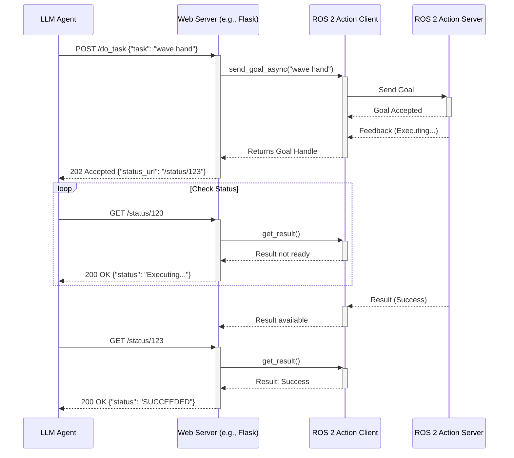

# Chapter 06 – Conclusion: Bridging a Mind to the Body

We have successfully built the foundational layers of our humanoid robot. We have a nervous system (ROS 2 packages), a sense of self-awareness about its physical form (URDF), and the ability for its different components to communicate (topics, services, actions).

But what about the mind? The specification for this book requires that we understand "exactly how Gemini 2.5 Flash will later inject commands into this nervous system." This chapter provides that bridge, outlining the architectural pattern we will use to connect an external AI, like a Large Language Model, to the ROS 2 ecosystem we have just built.

## 6.1 The "Action Proxy" Node Pattern

The most robust, scalable, and secure way to interface an external, non-ROS system with a ROS 2 network is to create a dedicated **Action Proxy Node**. This architectural pattern, often referred to as a "gateway," is a common solution for integrating ROS 2 with cloud-based systems or other IT infrastructure using web-friendly protocols like HTTP [^15].

This node serves as a single, well-defined gateway. Instead of exposing dozens of topics or services to the outside world, we will expose a single, high-level ROS 2 Action. The LLM will interact only with this Action, and the Action server (our proxy node) will be responsible for translating the LLM's commands into the lower-level ROS 2 messages needed to perform the task.

**Diagram: LLM-ROS 2 Bridge Architecture**
```mermaid
graph TD
    subgraph "External World (Non-ROS)"
        A[LLM Agent (e.g., Gemini 2.5 Flash)];
    end

    subgraph "ROS 2 World (humanoid_ws)"
        B(REST API Server);
        C{Action Proxy Node};
        D((/arm_control Topic));
        E((/navigation_goal Topic));
        F((/gripper_service Service));
    end
    
    A -- "{ \"command\": \"pick up the red cube\" }" --> B;
    B -- Calls Action Goal --> C;
    C -- "Goal: pick up the red cube" --> C;
    
    subgraph "Task Execution"
        C -- Translates Goal --> D;
        C -- Translates Goal --> E;
        C -- Translates Goal --> F;
    end

    style A fill:#f9f,stroke:#333,stroke-width:2px
    style B fill:#bbf,stroke:#333,stroke-width:2px
    style C fill:#bbf,stroke:#333,stroke-width:2px
```
This architecture has several key advantages:
1.  **Security & Stability**: The LLM does not have direct access to the robot's low-level controllers. It can only make high-level requests. Our proxy node validates and sanitizes these requests, preventing the LLM from sending malformed or dangerous commands directly to the hardware.
2.  **Abstraction**: The LLM doesn't need to know about the dozens of topics, services, and actions that control the robot. It just needs to know how to use the one high-level "do_robot_task" action. We can completely refactor the underlying ROS 2 system, and as long as the Action Proxy Node still understands the high-level commands, the LLM integration remains unchanged.
3.  **Feedback**: By using a ROS 2 Action, the LLM can receive continuous feedback about the task's progress and an eventual success or failure result. This is critical for complex, long-running tasks.

## 6.2 Defining the High-Level Action

Let's define what this action might look like. We would create a new file, `DoRobotTask.action`, in a new package or our `humanoid_interfaces` package. The structure of this `.action` file follows the same principles as the ROS 2 action definitions we have seen previously [^6].

**Code Example 19: `DoRobotTask.action`**
```python
# The high-level command from the LLM
string task_description
---
# The result of the action
bool success
string result_message
---
# Feedback on the current status
string current_status
float32 percent_complete
```

## 6.3 Implementing the Action Proxy Node

The implementation of the Action Proxy Node would involve creating an Action Server that accepts a `DoRobotTask` goal. The core logic of this server is a large "if/else" or dictionary-based dispatcher that parses the `task_description` string.

**Code Example 20: `action_proxy_node.py` (Conceptual)**
```python
# ... (imports for rclpy, actions, etc.)
from my_interfaces.action import DoRobotTask

class ActionProxyNode(Node):
    def __init__(self):
        super().__init__('action_proxy_node')
        self._action_server = ActionServer(
            self,
            DoRobotTask,
            'do_robot_task',
            self.execute_callback)
        # ... (initialize publishers/clients for low-level control)
        
    def execute_callback(self, goal_handle):
        self.get_logger().info(f'Executing goal: {goal_handle.request.task_description}')
        
        # Create feedback and result messages
        feedback_msg = DoRobotTask.Feedback()
        result = DoRobotTask.Result()

        # === CORE LOGIC: Parse the LLM command ===
        command = goal_handle.request.task_description.lower()
        
        if "wave your right hand" in command:
            # Call the service or publish the topic to wave the hand
            feedback_msg.current_status = "Waving hand..."
            goal_handle.publish_feedback(feedback_msg)
            # ... execute waving logic ...
            result.success = True
        
        elif "pick up the" in command:
            # More complex logic involving perception and motion planning
            feedback_msg.current_status = "Identifying object..."
            goal_handle.publish_feedback(feedback_msg)
            # ... perception logic ...
            
            feedback_msg.current_status = "Moving arm to object..."
            goal_handle.publish_feedback(feedback_msg)
            # ... motion planning logic ...
            
            result.success = True # if successful
        
        else:
            result.success = False
            result.result_message = "I don't know how to do that."

        goal_handle.succeed()
        return result
```

This node acts as a translator or an "intention-to-action" engine. The LLM provides the *intent* ("pick up the red cube"), and the proxy node is responsible for the *actions* required to make it happen.

To complete the bridge, a simple web server (like one using Flask or FastAPI) would be run, wrapping the ROS 2 action client. The LLM agent can then make a standard HTTP POST request to this web server to trigger the action and get the result.

**Diagram: HTTP to Action Sequence**


This concludes our first module. You now have a comprehensive understanding of the ROS 2 architecture, know how to build packages, can describe a robot's physical form, and see the clear path forward for connecting it to a powerful AI mind. You are ready to move on to the next modules, where we will dive deeper into simulation, perception, and control.

---

## References

[^6]: ROS 2 Documentation. "Understanding ROS 2 Actions — ROS 2 Documentation: Humble documentation." *ROS.org*, [https://docs.ros.org/en/humble/Tutorials/Beginner-CLI-Tools/Understanding-ROS2-Actions/Understanding-ROS2-Actions.html](https://docs.ros.org/en/humble/Tutorials/Beginner-CLI-Tools/Understanding-ROS2-Actions/Understanding-ROS2-Actions.html).
[^15]: G. Casado, R. M. L. R. da, "A ROS 2-Based Gateway for the New Generation of Cloud-Enabled Robotic Systems," *Applied Sciences*, vol. 12, no. 19, p. 9574, 2022. [https://www.mdpi.com/2076-3417/12/19/9574](https://www.mdpi.com/2076-3417/12/19/9574).
