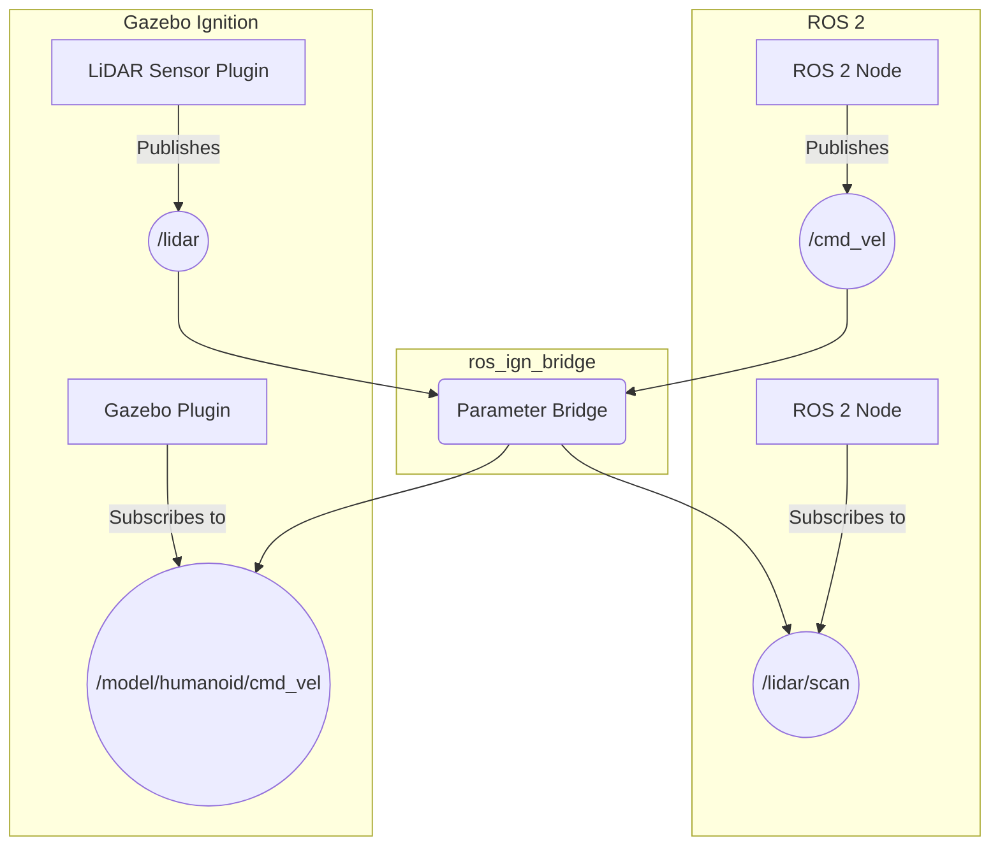
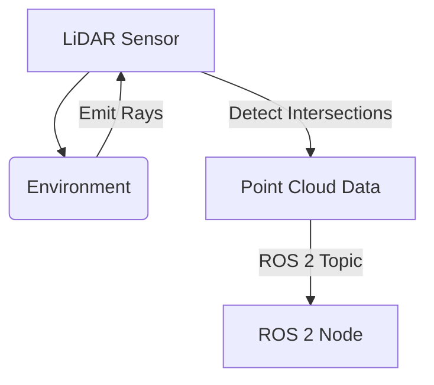

# Chapter 06 – Gazebo Ignition: Physics Engines, Plugins, and Sensor Simulation

Having established the nervous system and body (URDF) of our humanoid robot, the next crucial step is to bring it to life in a virtual world. This allows us to develop, test, and refine complex behaviors without risking damage to expensive hardware. **Gazebo Ignition** (now known simply as Gazebo) [^19], the latest generation of the Gazebo simulator, is the industry-standard tool for physics-accurate robot simulation within the ROS 2 ecosystem.

In this chapter, we will dive into Gazebo Ignition. We'll start by understanding its core architecture, including its physics engines and the Simulation Description Format (SDF). We'll then explore how to integrate our humanoid's URDF model, add custom plugins for enhanced functionality, and, critically, simulate a variety of realistic sensors essential for our robot's perception.

## 6.1 Gazebo Ignition Architecture and the SDF World

Gazebo Ignition (often referred to simply as Ignition or Gazebo) is designed for high-fidelity simulation of robots and their environments. Unlike its predecessor, Gazebo Classic, Ignition boasts a modular, plugin-based architecture, modern rendering capabilities, and a focus on scalability.

At the heart of any Ignition simulation is the **Simulation Description Format (SDF)** [^20]. While URDF (which we covered in Chapter 5) is excellent for describing a single robot's kinematic and dynamic properties, SDF is more powerful and comprehensive. SDF can describe:

*   **Robots (models):** Similar to URDF, but with extensions for nested models, dynamic properties, and more complex joints.
*   **Environments (worlds):** Static objects, terrain, lights, and environmental properties.
*   **Sensors:** Detailed specifications for cameras, LiDAR, IMUs, force-torque sensors, etc.
*   **Plugins:** Custom code to add behavior to models or the world.

An Ignition "world" file (`.sdf`) is an XML file that defines everything within a simulation scenario.

**Diagram: Ignition World Structure**
```mermaid
graph TD
    A[World SDF File] --> B[Physics Engine (e.g., DART, TPE)];
    A --> C[Lights];
    A --> D[Ground Plane];
    A --> E[Models (e.g., Humanoid, Furniture)];
    E --> F[Links];
    E --> G[Joints];
    E --> H[Sensors];
    E --> I[Plugins];
```

### Physics Engines

Ignition supports multiple physics engines, each with its strengths:
*   **DART:** Dynamic Animation and Robotics Toolkit. A high-performance, open-source physics engine commonly used in robotics research.
*   **TPE:** Trivial Physics Engine. A simpler, faster engine suitable for less demanding simulations.
*   **ODE:** Open Dynamics Engine. A long-standing, robust physics engine.

The choice of physics engine can significantly impact the realism and performance of your simulation, especially for humanoids where contact dynamics and balance are critical. You specify the physics engine within your world SDF [^21].

## 6.2 Integrating the Humanoid URDF into Ignition

While SDF can describe robots natively, it's often more convenient to leverage our existing URDF models and convert them to SDF for use in Ignition. The `ros_ign_gazebo` package provides the tools for this integration.

A key component is the `ros_ign_bridge`, which allows communication between ROS 2 topics and Ignition transport topics [^22]. This is how sensor data gets from Ignition to our ROS 2 nodes, and how our ROS 2 controllers send commands to simulated joints.

**Diagram: `ros_ign_bridge` Communication**


Let's assume we have our `humanoid.urdf.xacro` from Chapter 5. To load it into Ignition, we typically use a launch file and a specific Ignition plugin.

**Code Example 21: `humanoid_ignition.launch.py` (Conceptual)**
```python
import os
from ament_index_python.packages import get_package_share_directory
from launch import LaunchDescription
from launch.actions import DeclareLaunchArgument, IncludeLaunchDescription
from launch.launch_description_sources import PythonLaunchDescriptionSource
from launch.substitutions import LaunchConfiguration, Command
from launch_ros.actions import Node

def generate_launch_description():
    pkg_humanoid_description = get_package_share_directory('humanoid_description')
    pkg_ros_ign_gazebo = get_package_share_directory('ros_ign_gazebo')

    # Use xacro to process the URDF
    robot_description_content = Command([
        'xacro ', os.path.join(pkg_humanoid_description, 'urdf', 'humanoid.urdf.xacro')
    ])
    robot_description = {'robot_description': robot_description_content}

    # Gazebo world
    gazebo_world_path = os.path.join(
        get_package_share_directory('humanoid_simulation'), # Assuming a new simulation package
        'worlds',
        'humanoid_apartment.sdf' # Our custom world
    )

    return LaunchDescription([
        DeclareLaunchArgument(
            'gazebo_world',
            default_value=[gazebo_world_path],
            description='Gazebo world file'
        ),

        # Launch Gazebo
        IncludeLaunchDescription(
            PythonLaunchDescriptionSource(
                os.path.join(pkg_ros_ign_gazebo, 'launch', 'ign_gazebo.launch.py')
            ),
            launch_arguments={'ign_args': LaunchConfiguration('gazebo_world')}.items()
        ),

        # Publish robot description
        Node(
            package='robot_state_publisher',
            executable='robot_state_publisher',
            name='robot_state_publisher',
            output='screen',
            parameters=[robot_description]
        ),

        # Spawn the humanoid in Gazebo
        Node(
            package='ros_ign_gazebo',
            executable='create',
            arguments=[
                '-name', 'humanoid',
                '-topic', 'robot_description',
                '-x', '0', '-y', '0', '-z', '1.0'
            ],
            output='screen'
        ),
        
        # Bridge ROS topics to Gazebo topics (e.g., for joint commands)
        Node(
            package='ros_ign_bridge',
            executable='parameter_bridge',
            arguments=[
                '/humanoid/joint_commands@ros2_control_msgs/msg/JointCommand@ignition.msgs.JointWrench' # Example bridge
            ],
            output='screen'
        )
    ])
```
This launch file handles:
1.  Processing our `humanoid.urdf.xacro` into a valid URDF XML.
2.  Launching Gazebo Ignition with a specified world file.
3.  Running `robot_state_publisher` to broadcast the robot's transforms.
4.  Spawning our humanoid model into the Gazebo world.
5.  Setting up bridges between ROS 2 and Ignition topics, allowing us to control the robot.

## 6.3 Gazebo Ignition Plugins for Enhanced Functionality

Plugins are dynamically loaded shared libraries that extend Ignition's capabilities. They can be attached to worlds, models, links, or sensors. For humanoid robotics, key plugins include:

*   **ROS 2 Control Integration:** The `ros2_control` framework (which we will cover in a later module) is used to manage robot hardware. In simulation, we use Ignition plugins like `gz_ros2_control` to expose the simulated robot's joints to `ros2_control` as if it were real hardware [^23].

    **Diagram: `gz_ros2_control` Architecture**
    ```mermaid
    graph TD
        A[ROS 2 Controller] -- Joint Commands --> B{Controller Manager};
        B --> C{gz_ros2_control Plugin};
        C -- Applies Force/Velocity --> D(Simulated Joint);
        D -- Returns State --> C;
        C --> B;
        B -- Joint States --> A;
    end
    ```

*   **Sensor Plugins:** We'll dive into these next, but they are crucial for generating realistic sensor data [^24].
*   **Custom Logic:** You can write your own plugins to implement unique behaviors, such as object spawners, environmental effects, or complex contact logic.

**Diagram: Plugin Interaction**
```mermaid
graph TD
    A[Gazebo Ignition] --> B[World];
    B --> C[Model (Humanoid)];
    C --> D[Link (e.g., head)];
    D --> E[Sensor (e.g., camera)];
    E --> F[Camera Plugin (ROS 2)];
    F --> G[ROS 2 /camera/image_raw topic];
```

## 6.4 Simulating Sensors: LiDAR, Depth Cameras, IMUs, and Contact Sensors

High-fidelity sensor simulation is paramount for developing robust AI and control algorithms. The goal is often to minimize the **simulation-reality gap**, making simulated sensor data as close as possible to real-world data.

### 6.4.1 LiDAR (Light Detection and Ranging)

LiDAR sensors provide 3D point cloud data, crucial for mapping and navigation. Ignition's LiDAR sensor plugin can simulate various types of LiDAR, including 2D (planar) and 3D (spinning) scanners [^25].

**SDF Example: LiDAR Sensor**
```xml
<sensor name="lidar" type="gpu_lidar">
  <pose>0 0 0.1 0 0 0</pose> <!-- Relative to its parent link -->
  <always_on>1</always_on>
  <update_rate>10</update_rate>
  <lidar>
    <scan>
      <horizontal>
        <samples>640</samples>
        <resolution>1</resolution>
        <min_angle>-2.2</min_angle>
        <max_angle>2.2</max_angle>
      </horizontal>
      <vertical>
        <samples>16</samples>
        <resolution>1</resolution>
        <min_angle>-0.26</min_angle>
        <max_angle>0.26</max_angle>
      </vertical>
    </scan>
    <range>
      <min>0.1</min>
      <max>10.0</max>
      <resolution>0.01</resolution>
    </range>
    <noise type="gaussian">
      <mean>0.0</mean>
      <stddev>0.01</stddev>
    </noise>
  </lidar>
  <plugin filename="libignition-ros2-lidar-bridge-plugin.so"
          name="ignition::ros2::LidarBridge">
    <ros>
      <namespace>/lidar</namespace>
      <topic>scan</topic>
      <frame_id>lidar_link</frame_id>
    </ros>
  </plugin>
</sensor>
```
This SDF snippet defines a GPU-accelerated LiDAR sensor with specific scan properties and adds a ROS 2 bridge plugin to publish the data to a `/lidar/scan` topic.

**Diagram: LiDAR Ray Simulation**


### 6.4.2 Depth Cameras

Depth cameras (like RealSense) provide both color (RGB) images and per-pixel depth information. Ignition simulates these by rendering the scene from the camera's perspective and then calculating the distance to objects [^26].

**SDF Example: Depth Camera Sensor**
```xml
<sensor name="depth_camera" type="depth_camera">
  <pose>0.05 0 0.05 0 0 0</pose>
  <always_on>1</always_on>
  <update_rate>30</update_rate>
  <camera>
    <horizontal_fov>1.047</horizontal_fov>
    <image>
      <width>640</width>
      <height>480</height>
      <format>R8G8B8</format>
    </image>
    <clip>
      <near>0.1</near>
      <far>10.0</far>
    </clip>
    <noise type="gaussian">
      <mean>0.0</mean>
      <stddev>0.01</stddev>
    </noise>
  </camera>
  <plugin filename="libignition-ros2-camera-bridge-plugin.so"
          name="ignition::ros2::CameraBridge">
    <ros>
      <namespace>/camera</namespace>
      <topic>image_raw</topic>
      <frame_id>camera_link</frame_id>
    </ros>
  </plugin>
</sensor>
```
This configuration sets up a depth camera and bridges its image output to ROS 2 topics.

### 6.4.3 IMU (Inertial Measurement Unit)

IMUs provide linear acceleration and angular velocity, critical for state estimation and balance. Ignition's IMU plugin directly uses the simulated physics data [^27].

**SDF Example: IMU Sensor**
```xml
<sensor name="imu" type="imu">
  <pose>0 0 0 0 0 0</pose>
  <always_on>1</always_on>
  <update_rate>100</update_rate>
  <imu>
    <angular_velocity>
      <x>
        <noise type="gaussian">
          <mean>0.0</mean>
          <stddev>0.0002</stddev>
        </noise>
      </x>
      <y>
        <noise type="gaussian">
          <mean>0.0</mean>
          <stddev>0.0002</stddev>
        </noise>
      </y>
      <z>
        <noise type="gaussian">
          <mean>0.0</mean>
          <stddev>0.0002</stddev>
        </noise>
      </z>
    </angular_velocity>
    <linear_acceleration>
      <x>
        <noise type="gaussian">
          <mean>0.0</mean>
          <stddev>0.017</stddev>
        </noise>
      </x>
      <y>
        <noise type="gaussian">
          <mean>0.0</mean>
          <stddev>0.017</stddev>
        </noise>
      </y>
      <z>
        <noise type="gaussian">
          <mean>0.0</mean>
          <stddev>0.017</stddev>
        </noise>
      </z>
    </linear_acceleration>
  </imu>
  <plugin filename="libignition-ros2-imu-bridge-plugin.so"
          name="ignition::ros2::ImuBridge">
    <ros>
      <namespace>/imu</namespace>
      <topic>data</topic>
      <frame_id>imu_link</frame_id>
    </ros>
  </plugin>
</sensor>
```

### 6.4.4 Contact Sensors

Contact sensors detect collisions. For humanoids, these are crucial for foot-ground contact detection and interaction with objects [^28].

**SDF Example: Contact Sensor**
```xml
<sensor name="foot_contact" type="contact">
  <always_on>1</always_on>
  <update_rate>50</update_rate>
  <contact>
    <collision>right_foot_collision</collision> <!-- Reference to a collision element in the link -->
  </contact>
  <plugin filename="libignition-ros2-contact-bridge-plugin.so"
          name="ignition::ros2::ContactBridge">
    <ros>
      <namespace>/right_foot</namespace>
      <topic>contact</topic>
      <frame_id>right_foot_link</frame_id>
    </ros>
  </plugin>
</sensor>
```

By configuring these sensors within our robot's SDF and utilizing the appropriate ROS 2 bridge plugins, our simulated humanoid will generate a rich stream of data, almost as if it were interacting with the real world. This forms the foundation for developing perception and control algorithms before deploying them to the physical robot. In the next chapter, we will explore Unity as another powerful simulation environment, focusing on its strengths in high-fidelity rendering and human-robot interaction.

---

## References

[^19]: Gazebo Sim Documentation. "Ignition Fortress." *gazebosim.org*, [https://gazebosim.org/docs/fortress](https://gazebosim.org/docs/fortress).
[^20]: SDFormat. "Simulation Description Format." *sdformat.org*, [http://sdformat.org/](http://sdformat.org/).
[^21]: Gazebo Sim Documentation. "Physics." *gazebosim.org*, [https://gazebosim.org/docs/fortress/physics](https://gazebosim.org/docs/fortress/physics).
[^22]: Gazebo Sim Documentation. "ROS 2 Integration." *gazebosim.org*, [https://gazebosim.org/docs/fortress/ros_integration](https://gazebosim.org/docs/fortress/ros_integration).
[^23]: ROS 2 Control Documentation. "Gazebo
<system>." *control.ros.org*, [https://control.ros.org/master/doc/gz_ros2_control/doc/index.html](https://control.ros.org/master/doc/gz_ros2_control/doc/index.html).
[^24]: Gazebo Sim Documentation. "Creating Sensors." *gazebosim.org*, [https://gazebosim.org/docs/fortress/creating_sensors](https://gazebosim.org/docs/fortress/creating_sensors).
[^25]: Gazebo Sim Documentation. "Lidar / GPU Lidar Sensor." *gazebosim.org*, [https://gazebosim.org/docs/fortress/sensors#lidar-gpu-lidar](https://gazebosim.org/docs/fortress/sensors#lidar-gpu-lidar).
[^26]: Gazebo Sim Documentation. "Depth Camera Sensor." *gazebosim.org*, [https://gazebosim.org/docs/fortress/sensors#depth-camera-sensor](https://gazebosim.org/docs/fortress/sensors#depth-camera-sensor).
[^27]: Gazebo Sim Documentation. "IMU Sensor." *gazebosim.org*, [https://gazebosim.org/docs/fortress/sensors#imu-sensor](https://gazebosim.org/docs/fortress/sensors#imu-sensor).
[^28]: Gazebo Sim Documentation. "Contact Sensor." *gazebosim.org*, [https://gazebosim.org/docs/fortress/sensors#contact-sensor](https://gazebosim.org/docs/fortress/sensors#contact-sensor).
