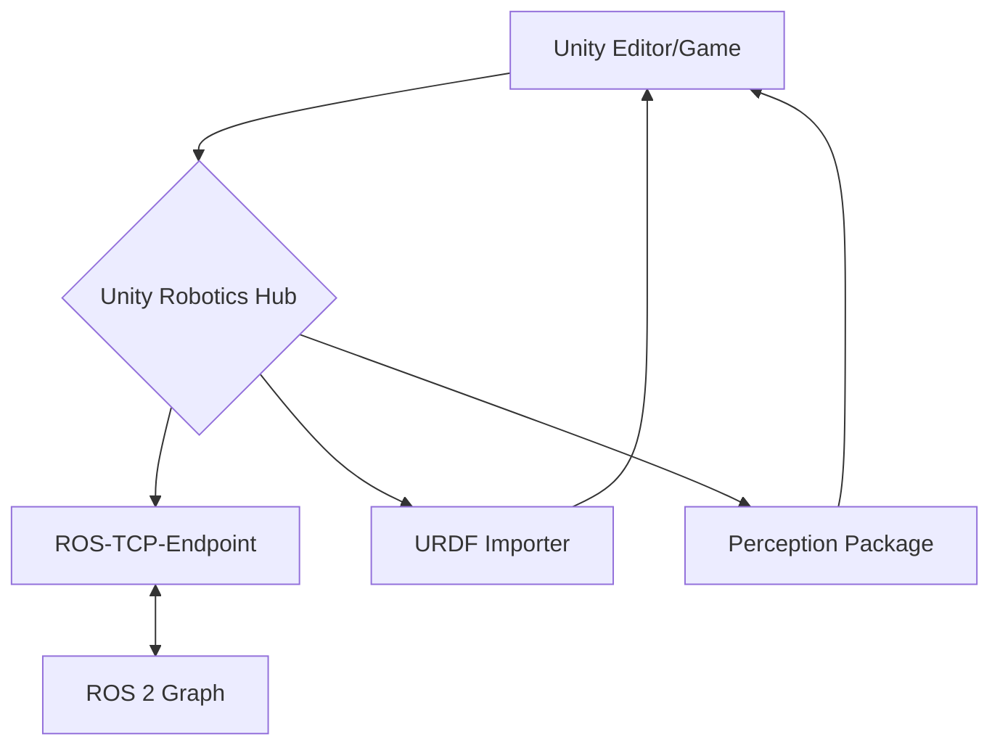
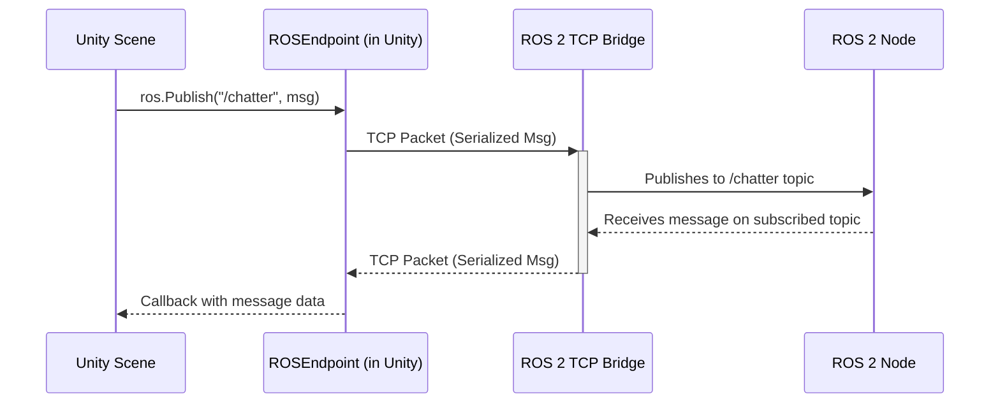
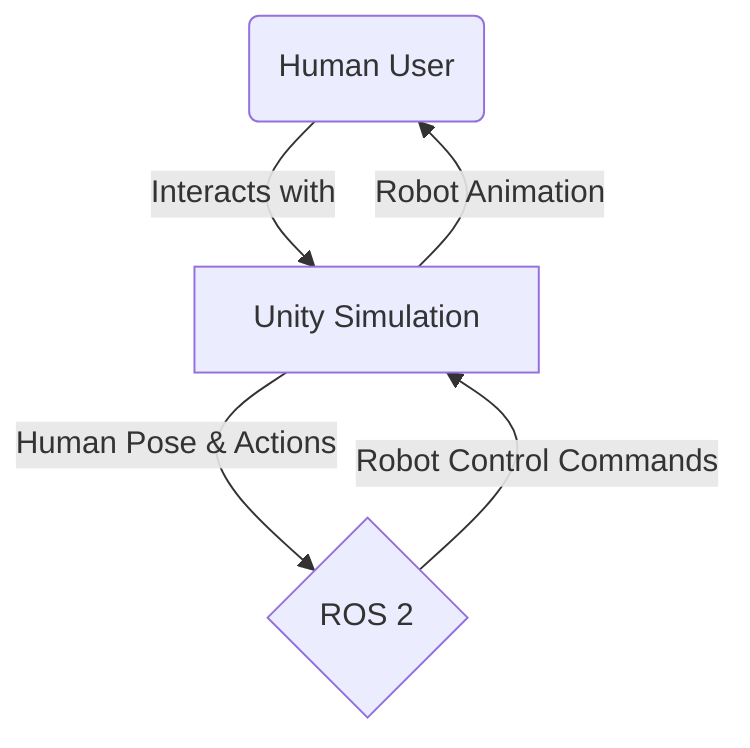

# Chapter 07 – Unity Robotics Hub + High-Fidelity Human–Robot Interaction

While Gazebo Ignition excels in physics accuracy and direct ROS 2 integration, the realm of robotics simulation often demands a different kind of fidelity: visual realism and advanced human–robot interaction. This is where **Unity** shines. Originally a game development platform, Unity has evolved into a powerful environment for creating visually stunning and highly interactive simulations, making it an ideal choice for tasks requiring human interaction, training, and photorealistic rendering.

In this chapter, we will explore the **Unity Robotics Hub** [^29], a collection of tools and resources designed to streamline robotics development within Unity. We'll learn how to bring our humanoid robot into Unity, establish a robust ROS 2 communication bridge, and leverage Unity's strengths to simulate rich human–robot interaction scenarios and visually compelling environments.

## 7.1 Unity for Robotics: Bridging the Visual and the Functional

Unity provides a powerful engine capable of rendering complex 3D scenes with advanced lighting, materials, and animations. For robotics, this translates into several key advantages:

*   **Photorealistic Environments:** Create virtual worlds that are visually indistinguishable from real-world locations, crucial for training AI models in diverse settings.
*   **High-Fidelity Sensor Simulation:** Generate visually accurate camera feeds (RGB, depth, segmentation) that can train perception algorithms.
*   **Advanced Human–Robot Interaction (HRI):** Simulate human presence using detailed avatars, motion capture, and realistic interaction physics, enabling the study and development of collaborative robotics.
*   **Rapid Prototyping:** Unity's intuitive editor and C# scripting environment allow for fast iteration on robot designs, control logic, and interaction paradigms.

The Unity Robotics Hub acts as the bridge between the ROS 2 ecosystem and the Unity engine, providing essential packages for communication, URDF import, and sensor simulation.

## 7.2 The Unity Robotics Hub: Key Packages

The Unity Robotics Hub is not a single tool but a collection of Unity packages and assets that facilitate robotics development. Key components include:

*   **ROS-TCP-Endpoint:** The core package for establishing TCP communication between Unity and a ROS 2 graph. It acts as a gateway, allowing Unity to publish ROS 2 messages and subscribe to ROS 2 topics [^30].
*   **URDF Importer:** A tool that converts URDF (and Xacro-generated URDF) files into Unity GameObject hierarchies, complete with colliders, rigidbodies, and configurable joints. This enables us to bring our humanoid directly into Unity [^31].
*   **Robotics Perception Package:** Provides tools for generating synthetic sensor data from Unity scenes, including RGB, depth, semantic segmentation, and instance segmentation images, often used for training machine learning models [^32].
*   **ROS 2 Generic Message Converters:** Automatically converts common ROS 2 message types into Unity-compatible formats.

**Diagram: Unity Robotics Hub Integration**


## 7.3 Importing URDF and Creating a Robot in Unity

Bringing our humanoid robot (defined in URDF) into Unity is a straightforward process thanks to the URDF Importer package.

1.  **Install URDF Importer:** Add the `com.unity.robotics.urdf-importer` package via Unity's Package Manager.
2.  **Import URDF:** In Unity, go to `Robotics > URDF Importer > Import URDF` and select your `humanoid.urdf` file (generated from Xacro, as in Chapter 5).
3.  **Configuration:** The Importer generates a Unity GameObject hierarchy that mirrors your URDF links and joints. It automatically adds `Rigidbody` components to links and configures `ArticulationBody` components (Unity's advanced joint system for physics-based robots) for joints [^33]. You can configure:
    *   **Physics Settings:** Mass, drag, friction.
    *   **Collision Layers:** For accurate interaction detection.
    *   **Materials:** Apply visually rich textures and shaders to your robot's parts.

Once imported, your humanoid is a manipulable GameObject in your Unity scene, ready for simulation.

## 7.4 Connecting to ROS 2 with ROS-TCP-Endpoint

The `ROS-TCP-Endpoint` package is the core of real-time communication between Unity and ROS 2. It establishes a TCP server in Unity (or a client connection to a ROS 2 TCP relay), allowing bidirectional message passing.

### Unity Setup

1.  **Add ROS-TCP-Endpoint:** Import the `com.unity.robotics.ros-tcp-endpoint` package.
2.  **Endpoint Configuration:** Add a `ROSEndpoint` component to a GameObject in your scene. Configure its `ROS IP Address` (the IP of your ROS 2 machine) and `ROS Port` (default 10000).
3.  **Message Generation:** Custom ROS 2 messages (`.msg`, `.srv`, `.action`) used in your ROS 2 packages can be automatically converted into C# classes in Unity. The `ROS Message Generation` tool in Unity (`Robotics > ROS > Generate ROS Messages`) facilitates this.

### ROS 2 TCP Bridge

On the ROS 2 side, a Python script (`ros_tcp_endpoint.py`) runs a TCP client that connects to the Unity `ROSEndpoint`. This client then translates between ROS 2 messages and the custom TCP protocol used by Unity.

**Diagram: ROS-TCP Communication Flow**


**Code Example 22: Conceptual Unity-ROS 2 Publisher (C# Script in Unity)**
```csharp
using RosMessageTypes.Std; // Generated ROS 2 message
using Unity.Robotics.ROSTCPConnector;
using UnityEngine;

public class UnityPublisher : MonoBehaviour
{
    ROSConnection ros;
    public string topicName = "/unity_chatter";
    public float publishMessageFrequency = 0.5f;

    private float timeElapsed;

    void Start()
    {
        ros = ROSConnection.Get  Instance();
        ros.RegisterPublisher<StringMsg>(topicName);
    }

    void Update()
    {
        timeElapsed += Time.deltaTime;
        if (timeElapsed > publishMessageFrequency)
        {
            StringMsg chatterMessage = new StringMsg("Hello from Unity!");
            ros.Publish(topicName, chatterMessage);
            timeElapsed = 0;
        }
    }
}
```
This C# script in Unity publishes a simple string message to a ROS 2 topic. Conversely, a Unity subscriber would listen to a ROS 2 topic and trigger actions within the Unity scene (e.g., move a robot joint based on a ROS 2 command).

## 7.5 High-Fidelity Human–Robot Interaction

Unity's visual prowess makes it an unparalleled platform for simulating rich human–robot interaction. This goes beyond simple collision detection; it encompasses visual, auditory, and even social cues.

*   **Realistic Avatars:** Integrate high-quality human avatars, potentially driven by motion capture data, to simulate human presence.
*   **Expressive Robots:** Animate humanoid robots with natural movements and gestures that respond to human actions or commands.
*   **Perception of Humans:** Use Unity's raycasting and physics systems to simulate the robot "seeing" and "touching" humans, feeding this data to perception algorithms. For example, a robot might detect a human's gaze direction.
*   **Virtual Control Panels:** Design interactive UI elements in 3D that humans can manipulate to control the robot or provide instructions.

This high level of visual detail and interaction allows for:
-   **Usability Testing:** Evaluate robot designs and interaction paradigms with virtual users.
-   **Training Data Generation:** Create vast datasets of human-robot interaction for AI training, including social navigation, collaborative tasks, and safety protocols.

**Diagram: HRI Feedback Loop in Unity**


## 7.6 Preparing for NVIDIA Isaac Sim

One of the key requirements for this module is to export scenes usable by NVIDIA Isaac Sim. While Unity and Isaac Sim are distinct platforms, a well-structured Unity scene can serve as an excellent starting point and asset source.

*   **Modular Asset Design:** Build environments and robot components as separate, reusable assets (prefabs in Unity).
*   **Standardized Formats:** Utilize common 3D formats like FBX or OBJ for meshes and textures.
*   **Clean Hierarchy:** Maintain a clear and logical GameObject hierarchy for easy understanding and re-import.
*   **Physics Properties:** Ensure Unity's `Rigidbody` and `ArticulationBody` components are correctly configured, as these properties often translate well conceptually to other physics engines.

While a direct "export to Isaac Sim" button does not exist, the assets and structural principles developed in Unity are highly valuable. The focus on high-fidelity visual assets, coupled with organized scene structure, minimizes the effort required to recreate or import elements into Isaac Sim.

By mastering Unity Robotics Hub, you gain the ability to create stunning, interactive, and intelligent simulations that extend beyond basic physics, providing a powerful platform for advanced robotics research and development. In the next chapter, we will combine the strengths of both Gazebo and Unity to build truly realistic indoor environments and integrate sophisticated sensor noise models, further bridging the simulation-reality gap.

---

## References

[^29]: Unity-Technologies. "Unity Robotics Hub." *GitHub*, [https://github.com/Unity-Technologies/Unity-Robotics-Hub](https://github.com/Unity-Technologies/Unity-Robotics-Hub).
[^30]: Unity-Technologies. "ROS-TCP-Connector." *GitHub*, [https://github.com/Unity-Technologies/ROS-TCP-Connector](https://github.com/Unity-Technologies/ROS-TCP-Connector).
[^31]: Unity-Technologies. "URDF-Importer." *GitHub*, [https://github.com/Unity-Technologies/URDF-Importer](https://github.com/Unity-Technologies/URDF-Importer).
[^32]: Unity Technologies. "Perception." *Unity Documentation*, [https://docs.unity3d.com/Packages/com.unity.perception@1.0/manual/index.html](https://docs.unity3d.com/Packages/com.unity.perception@1.0/manual/index.html).
[^33]: Unity Technologies. "ArticulationBody." *Unity Scripting API*, [https://docs.unity3d.com/ScriptReference/ArticulationBody.html](https://docs.unity3d.com/ScriptReference/ArticulationBody.html).
