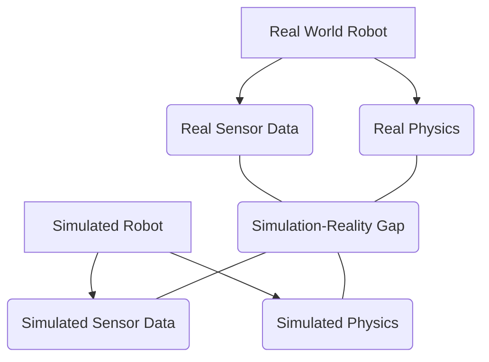

# Chapter 08 – Building Realistic Indoor Environments & Sensor Noise Models

With our humanoid robot now capable of inhabiting both physics-accurate Gazebo worlds and visually rich Unity scenes, the next critical step is to construct environments that challenge and prepare our AI for the complexities of the real world. This involves not only building photorealistic indoor spaces but also accurately modeling the imperfections and unpredictabilities inherent in real-world sensor data—what we refer to as **sensor noise**.

In this chapter, we will confront the **simulation-reality gap** head-on. We'll learn techniques for creating highly realistic indoor environments across both Gazebo Ignition and Unity. Crucially, we will delve into the science and implementation of sensor noise models, understanding how to make simulated sensor data practically indistinguishable from its real-world counterparts. Mastering these aspects is paramount to developing AI systems that seamlessly transfer from the digital twin to the physical robot.

## 8.1 The Simulation-Reality Gap: Understanding and Minimizing the Divide

The **simulation-reality gap** describes the discrepancy between the behavior of a robot in simulation and its behavior in the real world. This gap, a central challenge in robotics, can manifest in various ways [^34]:
*   **Physics Mismatch:** Simplified physics models, inaccurate friction, or poorly tuned joint limits in simulation.
*   **Visual Discrepancy:** Differences in lighting, textures, and object appearance.
*   **Sensor Model Inaccuracies:** Idealized sensor outputs that lack the noise, artifacts, and limitations of real sensors.

Minimizing this gap is crucial because a large gap means that AI models trained exclusively in simulation may perform poorly when deployed on the real robot. Our goal is to create simulations so accurate that AI models generalize effectively from the virtual to the physical domain. Realistic environments and sensor noise models are two of the most potent tools we have for achieving this.

**Diagram: Simulation-Reality Gap**


## 8.2 Building Realistic Indoor Environments

Creating identical, yet realistic, indoor environments in both Gazebo and Unity requires careful planning and the leveraging of each platform's strengths.

### 8.2.1 Realistic Environments in Gazebo Ignition

For physics-accurate simulations, Gazebo worlds are defined using SDF [^35]. To achieve realism:

*   **Import High-Fidelity Meshes:** Use 3D models (e.g., in `.dae`, `.stl`, `.obj` formats) of furniture, walls, and objects. These can be sourced from online repositories or created using CAD software. Ensure they have appropriate collision meshes.
*   **Physics Properties:** Assign realistic mass, inertia, and friction coefficients to all objects. Incorrect values can lead to unrealistic interactions (e.g., a robot pushing a wall that barely moves).
*   **Textures and Materials:** Apply physically-based rendering (PBR) textures to models to improve visual quality. While Ignition's rendering is not as advanced as Unity's, good textures make a difference.
*   **Lighting:** Add lights (directional, point, spot) to mimic real-world lighting conditions. Consider ambient light and shadows.
*   **Environmental Effects:** Simulate wind (for aerial robots, less for humanoids), fog, or dust if relevant to your scenario.
*   **World Generation Tools:** Utilize tools like Blender or commercial software to design complex indoor scenes and export them as SDF worlds or individual models.

**Code Example 23: Snippet of an SDF World for an Apartment**
```xml
<?xml version="1.0" ?>
<sdf version="1.6">
  <world name="humanoid_apartment">
    <include>
      <uri>model://sun</uri>
    </include>
    <include>
      <uri>model://ground_plane</uri>
    </include>

    <model name="apartment_walls">
      <static>true</static>
      <link name="link">
        <collision name="collision">
          <geometry><mesh><uri>file://path/to/apartment_walls.dae</uri></mesh></geometry>
        </collision>
        <visual name="visual">
          <geometry><mesh><uri>file://path/to/apartment_walls.dae</uri></mesh></geometry>
          <material>
            <script>
              <uri>file://path/to/materials/scripts</uri>
              <name>Apartment/WallPaint</name>
            </script>
          </material>
        </visual>
      </link>
    </model>

    <!-- Example of a furniture item -->
    <model name="couch">
      <pose>2 1 0.4 0 0 0</pose>
      <include>
        <uri>model://couch_model</uri> <!-- Assuming 'couch_model' is in Gazebo's model path -->
      </include>
    </model>

    <light type="point" name="ceiling_light">
      <pose>0 0 3 0 0 0</pose>
      <diffuse>0.8 0.8 0.8 1</diffuse>
      <specular>0.1 0.1 0.1 1</specular>
      <attenuation>
        <range>20</range>
        <constant>0.2</constant>
        <linear>0.01</linear>
        <quadratic>0.0</quadratic>
      </attenuation>
    </light>

  </world>
</sdf>
```

### 8.2.2 Photorealistic Environments in Unity

Unity excels at visual fidelity. To create a photorealistic apartment:

*   **High-Quality Asset Store Models:** Leverage Unity's Asset Store for architecturally accurate and high-detail 3D models of furniture, fixtures, and environmental elements.
*   **Physically Based Rendering (PBR) Materials:** Use PBR shaders and textures to ensure materials react realistically to light [^36]. This includes metallic, roughness, and normal maps.
*   **Advanced Lighting:** Utilize Unity's comprehensive lighting system:
    *   **Realtime Global Illumination (GI):** Simulates how light bounces and reflects off surfaces.
    *   **Baked Lighting:** Pre-calculate complex lighting for static objects to achieve high visual quality with less runtime cost.
    *   **HD Render Pipeline (HDRP):** For ultimate visual fidelity, especially important for camera sensor simulation.
*   **Post-Processing Effects:** Add camera effects like Ambient Occlusion, Bloom, Depth of Field, and Color Grading to enhance realism.
*   **Scene Composition:** Arrange assets logically, considering natural light flow and typical indoor layouts.
*   **Physics Parity (Conceptual):** While Unity's physics engine is powerful, ensure that the colliders for objects accurately represent their physical boundaries to maintain consistency with Gazebo's collision shapes.

**Diagram: Photorealistic Environment Pipeline (Unity)**
```mermaid
graph TD
    A[3D Models (FBX, OBJ)] --> B(PBR Materials);
    B --> C(Unity Scene Editor);
    C --> D[Realtime GI];
    C --> E[Baked Lighting];
    C --> F[Post-Processing Effects];
    F --> G[Photorealistic Environment];
```

## 8.3 Advanced Sensor Noise Models

Simulated sensors that output perfect data are often detrimental to training robust AI. Real sensors are inherently noisy, and replicating this noise is crucial.

### 8.3.1 Why Model Sensor Noise?

*   **Robustness:** AI models trained on noisy data are more robust to variations and imperfections in real-world sensor readings.
*   **Generalization:** Helps minimize the simulation-reality gap, allowing policies learned in simulation to generalize better to the real robot.
*   **Realistic Behavior:** Robot perception and control systems must cope with sensor uncertainty. Noise models force this reality into simulation.

### 8.3.2 Types of Sensor Noise

*   **Gaussian Noise:** Random fluctuations following a normal distribution (e.g., in IMU readings, LiDAR range).
*   **Impulse Noise (Salt-and-Pepper):** Sudden, high-amplitude spikes (e.g., occasional erroneous LiDAR returns).
*   **Dropout/Occlusion:** Missing data points due to sensor limitations or environmental factors (e.g., LiDAR in fog, camera glare).
*   **Quantization Noise:** Errors due to discrete measurement values (e.g., fixed resolution of depth sensors).
*   **Bias/Drift:** Systematic errors that change slowly over time (e.g., IMU drift).

### 8.3.3 Implementing Noise in Gazebo Ignition

Ignition allows direct configuration of sensor noise within the SDF. We saw examples in Chapter 6 for LiDAR and IMU.

**Code Example 24: Detailed Noise Configuration for a Depth Camera**
```xml
<sensor name="depth_camera" type="depth_camera">
  <!-- ... (camera configuration) ... -->
  <camera>
    <!-- ... (image and clip settings) ... -->
    <noise type="gaussian">
      <mean>0.0</mean>
      <stddev>0.005</stddev> <!-- Standard deviation of the Gaussian noise -->
      <limit>0.01</limit>    <!-- Max absolute value of noise -->
    </noise>
  </camera>
  <plugin filename="ignition-sensors-system" name="ignition::sensors::GaussianNoiseSystem">
    <mean>0.0</mean>
    <stddev>0.002</stddev>
  </plugin>
  <plugin filename="ignition-sensors-system" name="ignition::sensors::RangeNoiseSystem">
    <mean>0.0</mean>
    <stddev>0.001</stddev>
    <min_range>0.1</min_range>
    <max_range>10.0</max_range>
    <type>gaussian</type>
  </plugin>
</sensor>
```
For more complex noise, custom Ignition plugins can be developed to inject specific noise patterns.

### 8.3.4 Implementing Noise in Unity

Unity's Perception package is designed for generating synthetic datasets with realistic sensor characteristics, including noise.

*   **Perception Package:** Provides `Sensor` components (e.g., `CameraSensor`, `LidarSensor`) that allow you to configure various parameters, including:
    *   **Noise Models:** Gaussian, Poisson, speckle noise for cameras.
    *   **Motion Blur:** Replicates the blur seen in moving real-world cameras.
    *   **Occlusion:** Simulates partial sensor blockage.
*   **Custom Shaders/Post-Processing:** For highly specific or complex noise models, you can write custom shaders or post-processing effects that directly modify the rendered image or depth buffer before it's consumed by your perception algorithms. This allows for highly accurate replication of sensor artifacts (e.g., rolling shutter effects).

**Diagram: Sensor Noise Pipeline**
```mermaid
graph TD
    A[Ideal Sensor Data (Simulation)] --> B(Noise Model (Gaussian, Impulse, etc.));
    B --> C(Distorted Data);
    C --> D[Sensor Output (to AI)];
```

## 8.4 Iterative Refinement and Domain Randomization

Minimizing the simulation-reality gap is an ongoing process of iterative refinement.

*   **Compare Simulated vs. Real Data:** Regularly collect data from both simulated and real sensors and visually/quantitatively compare them. Adjust environment properties, sensor parameters, and noise models until the data is "indistinguishable (to the AI)."
*   **Domain Randomization (DR):** Instead of trying to perfectly match one real-world scenario, DR involves randomizing non-essential parameters in simulation (e.g., textures, lighting, object positions, noise parameters) across a wide range. This forces AI models to learn features that are robust to variations, making them more likely to generalize to unseen real-world conditions [^34]. This is particularly effective for training deep learning perception models.

**Diagram: Simulation-Reality Loop**
```mermaid
graph TD
    A[AI Model Training] --> B{Deploy to Real Robot};
    B --> C[Evaluate Performance];
    C --> D{Identify Sim-Real Gap};
    D --> E[Adjust Simulation (Env, Sensors, Noise, DR)];
    E --> F[New Simulated Data];
    F --> A;
```

## 8.5 Exporting Optimized Assets for NVIDIA Isaac Sim

As we prepare for Module 3, where we will transition to NVIDIA Isaac Sim, the assets and methodologies developed in this chapter are directly applicable. Isaac Sim leverages USD (Universal Scene Description) for its scene representation and is highly optimized for large-scale, high-fidelity simulations with NVIDIA GPUs.

The realistic 3D models, PBR textures, and organized scene structures built in Unity and Gazebo serve as ideal source material. Understanding how to create modular, performant assets is key to a smooth transition, allowing us to focus on Isaac Sim's advanced features for even more sophisticated data generation and robot control.

By mastering the art of environment building and sensor noise modeling, you equip your humanoid with digital senses that truly reflect reality, paving the way for AI that learns in simulation and performs brilliantly in the physical world.

---

## References

[^34]: J. Tobin, et al., "Domain Randomization for Transferring Deep Neural Networks from Simulation to the Real World," *2017 IEEE/RSJ International Conference on Intelligent Robots and Systems (IROS)*, 2017, pp. 23-30, [https://arxiv.org/abs/1703.06907](https://arxiv.org/abs/1703.06907).
[^35]: Gazebo Sim Documentation. "Building a world." *gazebosim.org*, [https://gazebosim.org/docs/fortress/building_world](https://gazebosim.org/docs/fortress/building_world).
[^36]: Unity Technologies. "Physically Based Rendering." *Unity Documentation*, [https://docs.unity3d.com/Manual/phys-PhysicallyBasedRendering.html](https://docs.unity3d.com/Manual/phys-PhysicallyBasedRendering.html).
