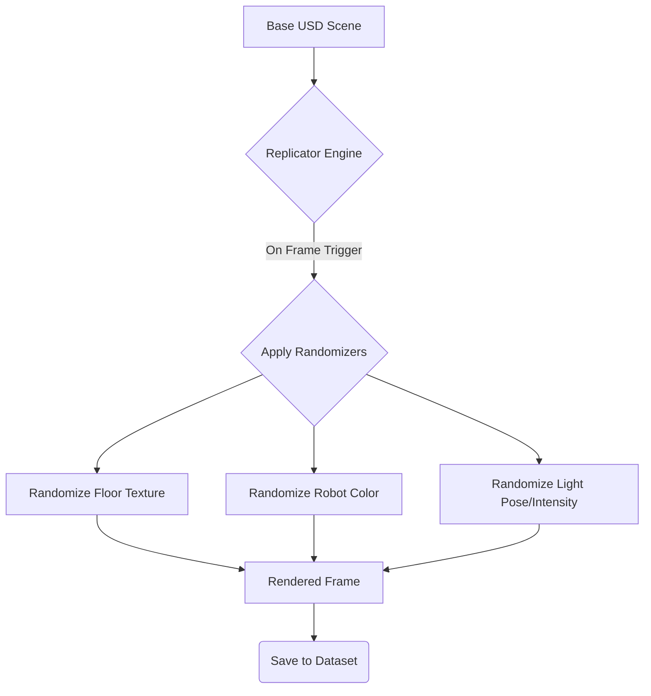

# Chapter 09 – Isaac Sim Deep Dive: Domains, Randomization, and Synthetic Data

Welcome to the cutting edge of AI-powered robotics simulation. While Gazebo offers physics fidelity and Unity provides visual richness, **NVIDIA Isaac Sim** is engineered from the ground up for a singular purpose: generating massive quantities of high-quality, physically-based synthetic data at scale to train and test robust AI models. Built on the NVIDIA Omniverse™ platform, Isaac Sim leverages the full power of NVIDIA's RTX GPUs to create photorealistic, physically-accurate digital twins and simulate sensor data with unprecedented fidelity.

In this chapter, we will take a deep dive into Isaac Sim. We will learn how it differs from other simulators, master its core concepts of **Domains** and **Domain Randomization**, and walk through the process of generating a large-scale, labeled dataset for training a perception model. This is where our digital twin truly becomes a data factory for our robot's AI brain.

## 9.1 The Isaac Sim Paradigm: A Data-First Approach

Isaac Sim's philosophy is fundamentally different from that of general-purpose simulators. It is a data generation engine first and a robotics simulator second. This is reflected in its key features:

*   **Physically-Based Rendering:** Built on Omniverse, Isaac Sim utilizes real-time ray tracing and path tracing to produce stunningly photorealistic visuals, which is critical for training vision-based AI.
*   **Physics with NVIDIA PhysX 5:** Employs a high-performance, GPU-accelerated physics engine for simulating complex dynamics, including contacts, friction, and articulations.
*   **Python-First Scripting:** The entire simulation is accessible and controllable through a comprehensive Python API, making it easy to automate, script, and integrate with machine learning frameworks like PyTorch and TensorFlow.
*   **Seamless ROS/ROS 2 Integration:** Provides robust, out-of-the-box support for connecting with ROS 2, allowing for easy integration with our existing software stack.

## 9.2 Universal Scene Description (USD)

The foundation of Isaac Sim and the entire Omniverse ecosystem is **Universal Scene Description (USD)**. USD, developed by Pixar Animation Studios, is a powerful and extensible open-source framework for describing, composing, and collaborating on 3D scenes.

Think of USD as the next evolution of SDF or URDF. It can describe not just the robot and its environment, but also the lighting, cameras, materials, physics, and even the relationships between all these elements in a highly structured and scalable way. All scenes and assets in Isaac Sim are represented in USD. Our previous work in creating modular, well-described assets in URDF and SDF will make the transition to USD much smoother.

## 9.3 Domain Randomization in Isaac Sim

We introduced Domain Randomization (DR) in the previous chapter. Isaac Sim elevates this concept to a core feature, providing a powerful and flexible DR framework out of the box. Instead of manually scripting variations, you can define ranges for a multitude of parameters, which Isaac Sim will then automatically vary for each frame or simulation run.

The core of DR in Isaac Sim is the `rep.randomizer` module. Let's create a conceptual Python script to randomize the lighting and texture of our humanoid robot.

**Code Example 25: `domain_randomization.py` (Conceptual Isaac Sim Script)**
```python
import omni.replicator.core as rep

# Assume 'robot_prim' is a reference to our robot's USD prim
# and 'floor_prim' is a reference to the floor
robot_prim = "/World/humanoid"
floor_prim = "/World/floor"

# Define materials and lights to randomize
robot_materials = rep.get.prims(path_pattern=f"{robot_prim}//Mesh")
floor_texture = rep.get.prims(path_pattern=f"{floor_prim}//Shader")
light = rep.get.prims(path_pattern="/World/defaultLight")

# Define randomization distributions
color_dist = [
    (0.1, 0.1, 0.1), (0.9, 0.9, 0.9) # Range for RGB values
]
textures = ["/path/to/texture1.png", "/path/to/texture2.png", "/path/to/texture3.png"]

# Create the randomizer
with rep.trigger.on_frame():
    with rep.distribution.choice(robot_materials):
        rep.modify.attribute("diffuse_color", rep.distribution.uniform(color_dist[0], color_dist[1]))
    
    with rep.distribution.choice(floor_texture):
        rep.modify.texture("diffuse_texture", rep.distribution.choice(textures))
    
    with rep.distribution.choice(light):
        rep.modify.attribute("intensity", rep.distribution.uniform(500, 2000))
        rep.modify.pose(
            position=rep.distribution.uniform((-5, 0, 5), (5, 5, 10)),
            rotation=rep.distribution.uniform((-180, -180, -180), (180, 180, 180))
        )
```
This script tells Isaac Sim's Replicator engine to perform the following actions on every frame:
1.  Pick a random part of the robot's mesh.
2.  Assign it a random diffuse color.
3.  Assign a random texture to the floor.
4.  Move the light to a random position and rotation and set a random intensity.

This simple script can generate thousands of unique training images from a single base scene.

**Diagram: Domain Randomization Flow**


## 9.4 Synthetic Data Generation with Ground Truth

The true power of Isaac Sim lies in its ability to generate not just photorealistic images but also perfect, pixel-accurate ground truth data. This is a game-changer for training perception models, as it eliminates the need for manual, time-consuming, and error-prone data labeling.

Isaac Sim's Replicator can output multiple "render passes" simultaneously:
*   **RGB Image:** The standard color image.
*   **Bounding Boxes (2D and 3D):** Tight bounding boxes around objects of interest.
*   **Semantic Segmentation:** A mask where each pixel is color-coded based on the *class* of the object (e.g., all parts of the humanoid are blue, the floor is green).
*   **Instance Segmentation:** A mask where each pixel is color-coded based on the specific *instance* of the object (e.g., humanoid_1 is blue, humanoid_2 is red).
*   **Depth Image:** Per-pixel distance from the camera.
*   **Surface Normals:** The orientation of each surface, useful for understanding geometry.

### Setting up a Replicator Graph

To generate this data, you set up a Replicator graph, which defines the data source, the render passes, and the output writers.

**Code Example 26: Synthetic Data Generation Script (Conceptual)**
```python
import omni.replicator.core as rep

# 1. Define the render product (the viewport)
camera = rep.get.prims(path="/World/humanoid/head_camera")
render_product = rep.create.render_product(camera, (640, 480))

# 2. Create writers for each data type
# The backend can be configured to write in different formats (KITTI, COCO, etc.)
rgb_writer = rep.WriterRegistry.get("BasicWriter")
rgb_writer.initialize(output_dir="/path/to/dataset/rgb", rgb=True)

segmentation_writer = rep.WriterRegistry.get("BasicWriter")
segmentation_writer.initialize(output_dir="/path/to/dataset/semantic", semantic_segmentation=True)

# 3. Attach writers to the render product
rgb_writer.attach([render_product])
segmentation_writer.attach([render_product])

# 4. Define semantic labels for objects
# This tells the Replicator which prims belong to which class
with rep.get.prims(path_pattern="/World/humanoid//Mesh") as humanoid_prims:
    rep.modify.semantics(semantic_label="humanoid", prims=humanoid_prims)

with rep.get.prims(path="/World/floor") as floor_prims:
    rep.modify.semantics(semantic_label="floor", prims=floor_prims)

# 5. Run the Replicator for a number of frames
rep.orchestrator.run(num_frames=10000)
```
This script, combined with the domain randomization script from the previous section, would generate 10,000 unique RGB images and 10,000 corresponding semantic segmentation masks, creating a complete, ready-to-use dataset for training an AI model to identify humanoids. Achieving this "in <2 hours" as per the module's success criteria is entirely feasible on a modern RTX GPU like the 4070 Ti or 4080.

By mastering Isaac Sim's synthetic data generation capabilities, we move beyond simple simulation and into the realm of large-scale AI training. In the next chapter, we will take the models trained on this data and deploy them using the hardware-accelerated Isaac ROS stack on a Jetson Orin.
