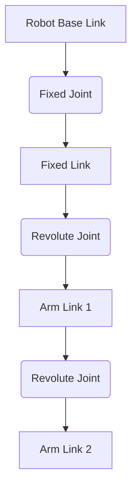

# Introduction to URDF Concepts

The Unified Robot Description Format (URDF) is an XML format for describing all aspects of a robot. It's used extensively in ROS to represent the robot's kinematic and dynamic properties, visualize the robot in simulators like Gazebo or RViz, and perform motion planning.

A URDF file essentially defines the robot's physical structure and how its parts move relative to each other. It consists primarily of two main elements: **links** and **joints**.

## 1. Links

A `<link>` element describes a rigid body part of the robot. This could be a wheel, a chassis, a robotic arm segment, or any other physical component that doesn't deform. Each link has several properties that define its physical characteristics:

*   **`<visual>`**: Describes how the link looks. This includes its geometry (e.g., box, cylinder, sphere, mesh) and material properties (e.g., color, texture). This is what you see in a simulator or visualization tool.
*   **`<collision>`**: Describes the physical properties of the link for collision detection. This is crucial for simulations where the robot interacts with its environment or itself. Often, a simplified geometry is used here to speed up collision calculations.
*   **`<inertial>`**: Describes the mass and inertia properties of the link. This is essential for accurate dynamic simulations, defining how the link responds to forces and torques. It includes the mass, center of mass (origin), and inertia matrix.

**Example Link Definition:**

```xml
<link name="base_link">
  <visual>
    <geometry>
      <box size="0.6 0.4 0.2" />
    </geometry>
    <material name="blue">
      <color rgba="0 0 0.8 1" />
    </material>
  </visual>
  <collision>
    <geometry>
      <box size="0.6 0.4 0.2" />
    </geometry>
  </collision>
  <inertial>
    <origin xyz="0 0 0" rpy="0 0 0" />
    <mass value="10" />
    <inertia ixx="1.0" ixy="0.0" ixz="0.0" iyy="1.0" iyz="0.0" izz="1.0" />
  </inertial>
</link>
```

## 2. Joints

A `<joint>` element describes the connection between two links. It defines the kinematic relationship (how one link moves relative to another) and specifies the axis of rotation or translation.

Key attributes of a joint include:

*   **`name`**: A unique identifier for the joint.
*   **`type`**: Defines the type of movement. Common types include:
    *   `revolute`: A rotating joint with a limited range (e.g., a hinge).
    *   `continuous`: A rotating joint with an unlimited range (e.g., a wheel).
    *   `prismatic`: A sliding joint along an axis.
    *   `fixed`: No movement between the two links (they are rigidly attached).
*   **`<parent>`**: Specifies the name of the link that this joint is attached to (closer to the robot's base).
*   **`<child>`**: Specifies the name of the link that moves relative to the parent link.
*   **`<origin>`**: Defines the transform from the parent link's frame to the child link's frame, including position (`xyz`) and orientation (`rpy` - roll, pitch, yaw).
*   **`<axis>`**: For revolute, continuous, and prismatic joints, this defines the axis of rotation or translation.
*   **`<limit>`**: For revolute and prismatic joints, this defines the upper and lower bounds of movement, as well as velocity and effort limits.

**Example Joint Definition:**

```xml
<joint name="chassis_to_wheel_right_joint" type="continuous">
  <parent link="chassis_link" />
  <child link="wheel_right_link" />
  <origin xyz="0.2 -0.25 -0.1" rpy="0 0 0" />
  <axis xyz="0 1 0" />
</joint>
```

## Putting it Together

A complete URDF file describes your robot as a hierarchical structure of links connected by joints, forming a kinematic chain. Understanding these fundamental elements is key to creating robust and accurate robot models for simulation and control.

Below is the `simple_box.urdf` we created earlier:

```xml
<?xml version="1.0"?>
<robot name="simple_box_robot">
  <link name="base_link">
    <visual>
      <geometry>
        <box size="0.2 0.2 0.2"/>
      </geometry>
      <material name="red">
        <color rgba="1 0 0 1"/>
      </material>
    </visual>
    <collision>
      <geometry>
        <box size="0.2 0.2 0.2"/>
      </geometry>
    </collision>
    <inertial>
      <mass value="0.1"/>
      <inertia ixx="0.001" ixy="0.0" ixz="0.0" iyy="0.001" iyz="0.0" izz="0.001"/>
    </inertial>
  </link>
</robot>
```

<!-- DIAGRAM: URDF_Structure -->

